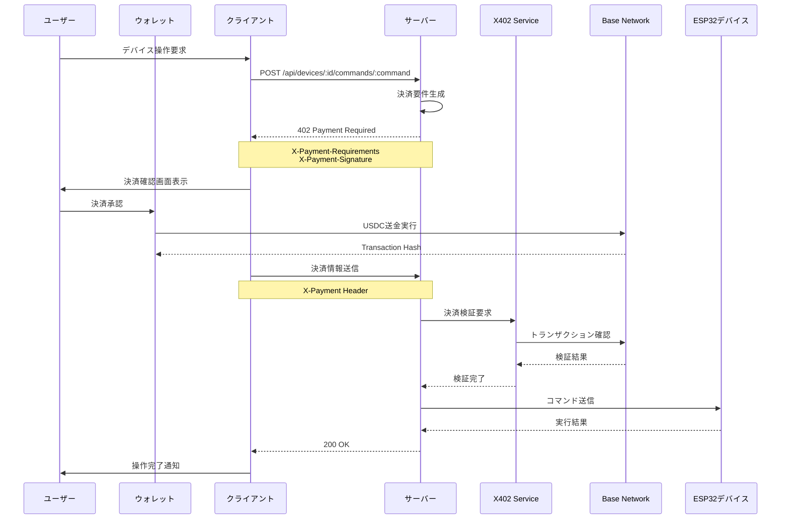

# Nagesen Gacha Live (xCockpit) - 投げ銭ガチャライブ

[English Ver README is here](README-ja.md) 

## 概要

Nagesen Gacha Live (xCockpit)は、ブロックチェーン決済を活用した革新的なIoTデバイス制御プラットフォームです。ESP32ベースのガチャマシンを、Base Network上のUSDC決済を通じてリモート制御できます。X402プロトコル（HTTP 402 Payment Required）を実装し、マイクロペイメントによるデバイス制御を実現しています。

## 主な特徴

- **🎮 リアルタイムデバイス制御**: WebSocket通信による即座のデバイス操作
- **💰 ブロックチェーン決済**: Base Network（Ethereum L2）上でのUSDC決済
- **🔒 x402プロトコル**: HTTP 402ステータスを活用した安全な決済フロー
- **📹 ライブストリーミング**: デバイスのリアルタイム映像配信
- **🎯 カスタマイズ可能な料金設定**: デバイスごとに柔軟な料金設定が可能
- **🔐 セキュアな署名検証**: HMAC-SHA256による決済要件の署名検証

## アーキテクチャ図


## システム構成

### デバイス情報

#### Nagesen Gacha Live (ESP32_001)
- **タイプ**: ガチャマシン
- **料金**: ユーザーが自由に設定可能（デフォルト: $0.000 USDC）
- **特徴**: プレイごとに料金がリセットされる投げ銭型システム

#### Gacha Live Demo (ESP32_001)
- **タイプ**: ガチャマシン
- **料金**: $0.123 USDC（固定）
- **特徴**: デモンストレーション用の固定料金デバイス

## 技術スタック

### フロントエンド
- **フレームワーク**: React 18 + Vite 5
- **UIライブラリ**: Radix UI + Tailwind CSS
- **状態管理**: TanStack Query
- **ウォレット連携**: Coinbase Wallet SDK, OnchainKit

### バックエンド
- **ランタイム**: Node.js + TypeScript
- **フレームワーク**: Express
- **WebSocket**: ws ライブラリ
- **ブロックチェーン**: ethers.js v6

### ブロックチェーン
- **ネットワーク**: Base Network (Ethereum L2)
  - Testnet: Base Sepolia (Chain ID: 84532)
  - Mainnet: Base Mainnet (Chain ID: 8453)
- **決済通貨**: USDC
- **スマートコントラクト**: ERC-20 USDC Token

### システムフロー




## インストール

### 必要要件
- Node.js 18以上
- npm または yarn
- MetaMaskまたはCoinbase Wallet

### セットアップ手順

1. リポジトリのクローン
```bash
git clone https://github.com/your-repo/xCockpit.git
cd xCockpit
```

2. 依存関係のインストール
```bash
npm install
```

3. 環境変数の設定
```bash
cp .env.example .env
```

以下の環境変数を設定してください：
```env
# ネットワーク設定
NETWORK=sepolia               # sepolia | mainnet

# ブロックチェーン
BASE_SEPOLIA_RPC=https://sepolia.base.org
BASE_SEPOLIA_USDC=0x036CbD53842c5426634e7929541eC2318f3dCF7e

# セキュリティ
X402_HMAC_SECRET=your_secret_key_here
PAYMENT_RECIPIENT=0x1c7d4b196cb0c7b01d743fbc6116a902379c7238

# API設定
VITE_API_URL=http://localhost:5000
VITE_WS_URL=ws://localhost:5000
```

4. 開発サーバーの起動
```bash
# バックエンドサーバー
npm run dev

# フロントエンド（別ターミナル）
cd client
npm run dev
```

## 使用方法

### 1. ウォレット接続
画面右上の「Connect Wallet」ボタンをクリックし、MetaMaskまたはCoinbase Walletを接続します。

### 2. 料金設定（Nagesen Gacha Liveのみ）
- 「Set Fee」ボタンをクリック
- 希望の料金を入力（0.001〜999 USDC）
- 「Save」をクリックして保存

### 3. デバイス操作
- 料金設定後、「Play Gacha」ボタンをクリック
- ウォレットで決済を承認
- デバイスが自動的に動作開始

### 4. ライブ映像確認
左側のビデオストリームでデバイスの動作をリアルタイムで確認できます。

## X402プロトコルフロー

1. **コマンド要求**: クライアントがデバイスコマンドを要求
2. **402レスポンス**: サーバーが決済要件を返送
3. **決済実行**: ユーザーがUSDC決済を実行
4. **検証**: サーバーがブロックチェーン上で決済を検証
5. **コマンド実行**: 検証成功後、デバイスにコマンドを送信

## API エンドポイント

### デバイス管理
- `GET /api/devices` - デバイス一覧取得
- `GET /api/devices/:id` - デバイス詳細
- `POST /api/devices/:id/commands/:command` - コマンド実行
- `POST /api/devices/:id/fee` - 料金設定
- `GET /api/devices/:id/fee` - 料金取得

### 決済処理
- `POST /api/payments/verify` - 決済検証
- `GET /api/payments/:walletAddress` - 決済履歴

### システム
- `GET /api/websocket/status` - WebSocket接続状態
- `GET /api/admin/health` - ヘルスチェック

## セキュリティ

- **HMAC-SHA256署名**: すべての決済要件に署名を付与
- **Nonce管理**: リプレイ攻撃を防止
- **有効期限**: 決済要求に5分間の時限制
- **オンチェーン検証**: すべての決済をブロックチェーン上で確認

## トラブルシューティング

### ウォレット接続エラー
- ブラウザの拡張機能でMetaMask/Coinbase Walletが有効か確認
- Base Sepoliaネットワークに切り替えているか確認
- テストネット用のUSDCを保有しているか確認

### デバイス操作エラー
- デバイスがオンライン状態か確認
- 料金が正しく設定されているか確認
- ウォレットに十分なUSDC残高があるか確認

### 映像が表示されない
- WebSocket接続が確立されているか確認
- ファイアウォール設定を確認
- ブラウザのコンソールでエラーを確認

## 開発者向け情報

### テスト実行
```bash
npm test
```

### ビルド
```bash
npm run build
```

### 型チェック
```bash
npm run typecheck
```

### リント
```bash
npm run lint
```

## コントリビューション

プルリクエストを歓迎します。大きな変更の場合は、まずissueを開いて変更内容を議論してください。

## 関連リンク

- [Base Network](https://base.org)
- [X402 Protocol Specification](https://x402.org)
- [Coinbase Wallet SDK](https://docs.cloud.coinbase.com/wallet-sdk/docs)
