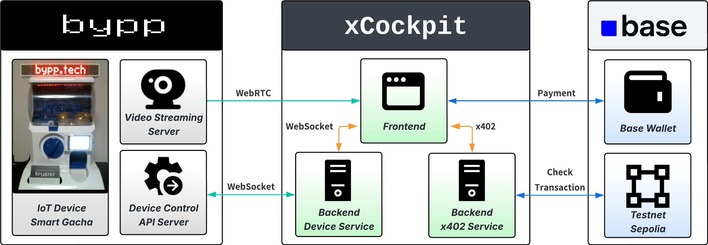
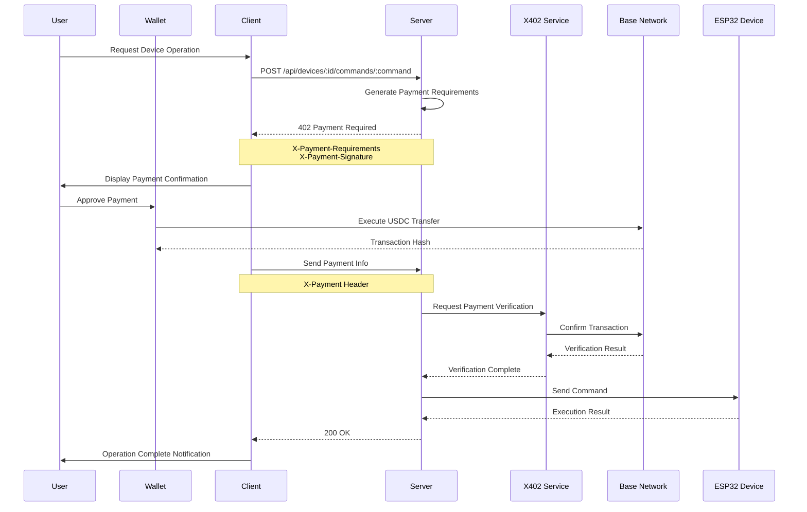

# Nagesen Gacha Live (xCockpit) - Live Gacha with USDC Tips

[日本語版 README はこちら](README-ja.md) 

## Overview

Nagesen Gacha Live (xCockpit) is an innovative IoT device control platform powered by blockchain payments. It enables remote control of ESP32-based gacha machines through USDC payments on Base Network. Implementing the X402 protocol (HTTP 402 Payment Required), it realizes device control through micropayments.

## Key Features

- **🎮 Real-time Device Control**: Instant device operation via WebSocket communication
- **💰 Blockchain Payments**: USDC payments on Base Network (Ethereum L2)
- **🔒 X402 Protocol**: Secure payment flow utilizing HTTP 402 status
- **📹 Live Streaming**: Real-time device video feed
- **🎯 Customizable Pricing**: Flexible pricing options per device
- **🔐 Secure Signature Verification**: Payment requirement signing with HMAC-SHA256

## Architecture Diagram



## System Configuration

### Device Information

#### Nagesen Gacha Live (ESP32_001)
- **Type**: Gacha Machine
- **Fee**: User-configurable (Default: $0.000 USDC)
- **Feature**: Tip-jar style system with fee reset after each play

#### Gacha Live Demo (ESP32_002)
- **Type**: Gacha Machine
- **Fee**: $0.123 USDC (Fixed)
- **Feature**: Fixed-fee demonstration device

## Technology Stack

### Frontend
- **Framework**: React 18 + Vite 5
- **UI Library**: Radix UI + Tailwind CSS
- **State Management**: TanStack Query
- **Wallet Integration**: Coinbase Wallet SDK, OnchainKit

### Backend
- **Runtime**: Node.js + TypeScript
- **Framework**: Express
- **WebSocket**: ws library
- **Blockchain**: ethers.js v6

### Blockchain
- **Network**: Base Network (Ethereum L2)
  - Testnet: Base Sepolia (Chain ID: 84532)
  - Mainnet: Base Mainnet (Chain ID: 8453)
- **Payment Currency**: USDC
- **Smart Contract**: ERC-20 USDC Token

### System Flow



## Installation

### Requirements
- Node.js 18+
- npm or yarn
- MetaMask or Coinbase Wallet

### Setup Instructions

1. Clone the repository
```bash
git clone https://github.com/your-repo/xCockpit.git
cd xCockpit
```

2. Install dependencies
```bash
npm install
```

3. Configure environment variables
```bash
cp .env.example .env
```

Set the following environment variables:
```env
# Network Configuration
NETWORK=sepolia               # sepolia | mainnet

# Blockchain
BASE_SEPOLIA_RPC=https://sepolia.base.org
BASE_SEPOLIA_USDC=0x036CbD53842c5426634e7929541eC2318f3dCF7e

# Security
X402_HMAC_SECRET=your_secret_key_here
PAYMENT_RECIPIENT=0x1c7d4b196cb0c7b01d743fbc6116a902379c7238

# API Configuration
VITE_API_URL=http://localhost:5000
VITE_WS_URL=ws://localhost:5000
```

4. Start development servers
```bash
# Backend server
npm run dev

# Frontend (in separate terminal)
cd client
npm run dev
```

## Usage

### 1. Connect Wallet
Click the "Connect Wallet" button in the top right corner and connect MetaMask or Coinbase Wallet.

### 2. Set Fee (Nagesen Gacha Live only)
- Click "Set Fee" button
- Enter desired fee (0.001-999 USDC)
- Click "Save" to confirm

### 3. Operate Device
- After setting fee, click "Play Gacha" button
- Approve payment in wallet
- Device automatically starts operation

### 4. View Live Stream
Monitor device operation in real-time via the video stream on the left side.

## X402 Protocol Flow

1. **Command Request**: Client requests device command
2. **402 Response**: Server returns payment requirements
3. **Payment Execution**: User executes USDC payment
4. **Verification**: Server verifies payment on blockchain
5. **Command Execution**: After successful verification, command is sent to device

## API Endpoints

### Device Management
- `GET /api/devices` - Get device list
- `GET /api/devices/:id` - Get device details
- `POST /api/devices/:id/commands/:command` - Execute command
- `POST /api/devices/:id/fee` - Set fee
- `GET /api/devices/:id/fee` - Get fee

### Payment Processing
- `POST /api/payments/verify` - Verify payment
- `GET /api/payments/:walletAddress` - Payment history

### System
- `GET /api/websocket/status` - WebSocket connection status
- `GET /api/admin/health` - Health check

## Security

- **HMAC-SHA256 Signatures**: All payment requirements are signed
- **Nonce Management**: Prevents replay attacks
- **Expiration**: 5-minute time limit on payment requests
- **On-chain Verification**: All payments verified on blockchain

## Troubleshooting

### Wallet Connection Errors
- Verify MetaMask/Coinbase Wallet extension is enabled in browser
- Confirm you're switched to Base Sepolia network
- Ensure you have testnet USDC

### Device Operation Errors
- Check device is online
- Verify fee is correctly set
- Confirm wallet has sufficient USDC balance

### Video Not Displaying
- Verify WebSocket connection is established
- Check firewall settings
- Review browser console for errors

## Developer Information

### Run Tests
```bash
npm test
```

### Build
```bash
npm run build
```

### Type Checking
```bash
npm run typecheck
```

### Linting
```bash
npm run lint
```

## Contributing

Pull requests are welcome. For major changes, please open an issue first to discuss the proposed changes.

## Related Links

- [Base Network](https://base.org)
- [X402 Protocol Specification](https://x402.org)
- [Coinbase Wallet SDK](https://docs.cloud.coinbase.com/wallet-sdk/docs)
