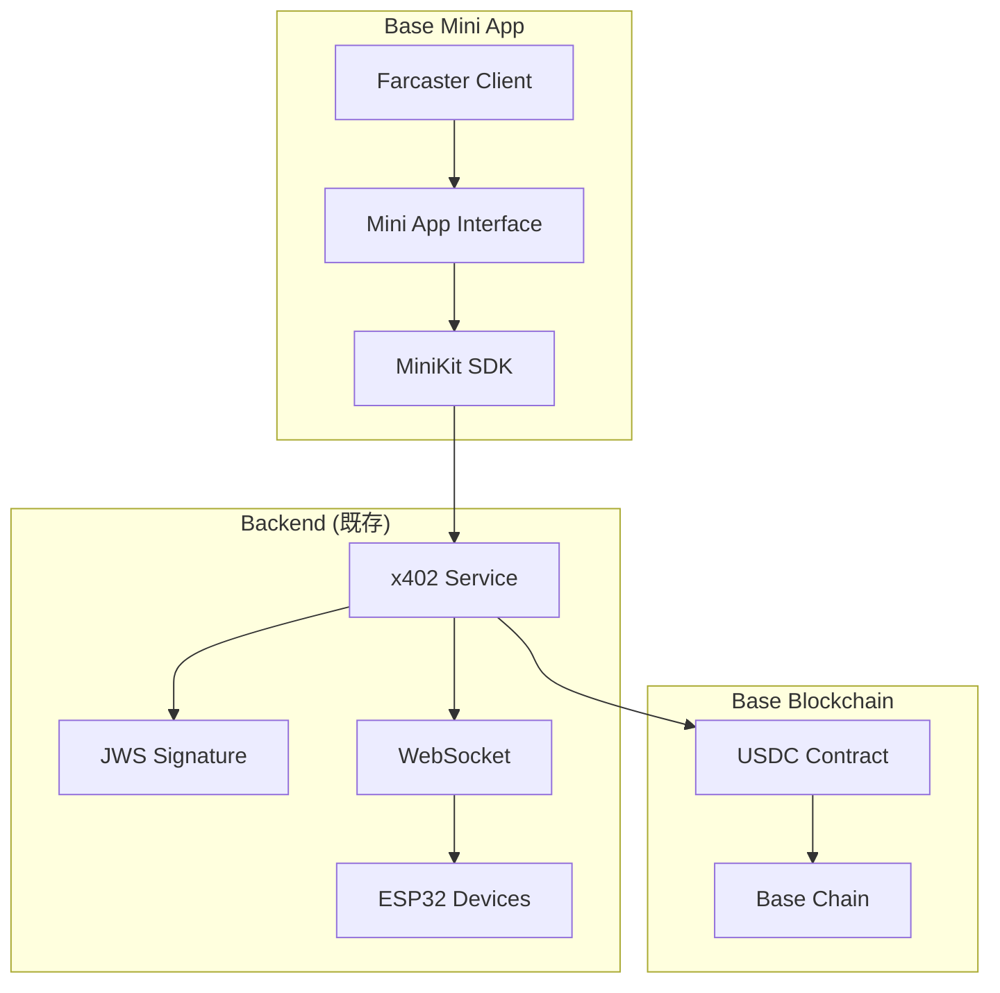

# x402決済システム - Base Mini Apps移行計画

## 概要

現在のx402 HTTP Payment Requiredプロトコルを活用した決済システムを、Base Mini Apps（Farcaster）対応のソーシャルネイティブアプリケーションに移行する計画です。

## 現在のシステム構成

### Backend (Node.js/TypeScript)
- **x402 Payment Protocol**: HTTP 402 Payment Required実装
- **JWS署名システム**: クライアント側検証対応
- **デバイス制御**: ESP32 IoTデバイス（Gacha機）
- **WebSocket通信**: リアルタイムデバイス制御
- **Multi-Strategy署名**: HMAC/JWS対応

### Frontend (想定)
- Next.js/React アプリケーション
- Web3 決済インターフェース
- リアルタイムデバイス状態表示

## Base Mini Apps移行のメリット

### 1. ソーシャル統合
- **ゼロインストール**: フレーム内で即座に起動
- **ウイルス拡散**: Farcasterフィード内での共有
- **ソーシャルコンテキスト**: ユーザーの友達ネットワーク活用

### 2. 技術的利点
- **瞬間起動**: アプリストア不要
- **クロスプラットフォーム**: 全デバイス対応
- **組み込み認証**: MiniKit認証システム

### 3. ユーザー体験
- **フリクションレス**: 即座にガチャ体験
- **ソーシャル共有**: 結果を簡単に共有
- **発見性**: Base Appで自動インデックス

## 実装アーキテクチャ



## 段階的移行計画

### Phase 1: MiniKit基盤実装
**期間**: 1週間

#### 1.1 プロジェクト初期化
```bash
# Mini App scaffolding
npx create-onchain --mini x402-gacha-miniapp
cd x402-gacha-miniapp
npm install
```

#### 1.2 必要依存関係
```json
{
  "dependencies": {
    "@coinbase/minikit": "^latest",
    "@farcaster/minikit": "^latest", 
    "onchainkit": "^latest",
    "viem": "^latest",
    "wagmi": "^latest",
    "next": "^14",
    "react": "^18"
  }
}
```

#### 1.3 基本MiniKit統合
```typescript
// app/layout.tsx
import { MiniKitProvider } from '@coinbase/minikit'

export default function RootLayout({
  children,
}: {
  children: React.ReactNode
}) {
  return (
    <html lang="ja">
      <body>
        <MiniKitProvider>
          {children}
        </MiniKitProvider>
      </body>
    </html>
  )
}
```

#### 1.4 認証フロー実装
```typescript
// hooks/useAuth.ts
import { useAuthenticate, useMiniKit } from '@coinbase/minikit'

export function useAuth() {
  const { isReady } = useMiniKit()
  const { authenticate, isAuthenticated, user } = useAuthenticate()
  
  return {
    isReady,
    authenticate, 
    isAuthenticated,
    user,
    login: async () => {
      if (!isReady) return false
      return await authenticate()
    }
  }
}
```

### Phase 2: x402決済統合
**期間**: 1週間

#### 2.1 x402クライアント実装
```typescript
// lib/x402-client.ts
export class X402MiniAppClient {
  private baseUrl: string
  private deviceId: string
  
  constructor(baseUrl: string) {
    this.baseUrl = baseUrl
  }
  
  async requestDeviceCommand(deviceId: string, command: string) {
    // 既存のx402プロトコルを活用
    const response = await fetch(`${this.baseUrl}/api/devices/${deviceId}/commands/${command}`, {
      method: 'POST',
      headers: {
        'Content-Type': 'application/json'
      }
    })
    
    if (response.status === 402) {
      // x402 Payment Required
      const paymentInfo = await response.json()
      const requirements = response.headers.get('X-Payment-Requirements')
      const signature = response.headers.get('X-Payment-Signature')
      
      return {
        requiresPayment: true,
        paymentInfo,
        requirements,
        signature
      }
    }
    
    return await response.json()
  }
  
  async submitPayment(deviceId: string, command: string, txHash: string, paymentData: any) {
    const paymentHeader = btoa(JSON.stringify(paymentData))
    
    const response = await fetch(`${this.baseUrl}/api/devices/${deviceId}/commands/${command}`, {
      method: 'POST',
      headers: {
        'Content-Type': 'application/json',
        'X-Payment': paymentHeader
      },
      body: JSON.stringify({ walletAddress: paymentData.walletAddress })
    })
    
    return await response.json()
  }
}
```

#### 2.2 決済フロー統合
```typescript
// components/GachaInterface.tsx
import { useAuth } from '@/hooks/useAuth'
import { useMiniKit, useOpenUrl } from '@coinbase/minikit'
import { X402MiniAppClient } from '@/lib/x402-client'

export function GachaInterface({ deviceId }: { deviceId: string }) {
  const { isAuthenticated, user } = useAuth()
  const { sendTransaction } = useMiniKit()
  const { openUrl } = useOpenUrl()
  const client = new X402MiniAppClient(process.env.NEXT_PUBLIC_API_URL)
  
  const handleGachaActivation = async () => {
    try {
      // Step 1: Request device command (x402 flow)
      const result = await client.requestDeviceCommand(deviceId, 'activate')
      
      if (result.requiresPayment) {
        // Step 2: Execute payment transaction
        const txResult = await sendTransaction({
          to: result.paymentInfo.payment.accepts[0].recipient,
          value: BigInt(result.paymentInfo.payment.accepts[0].amount),
          data: '0x'
        })
        
        if (txResult.success) {
          // Step 3: Submit payment proof
          const paymentData = {
            amount: result.paymentInfo.payment.accepts[0].amount,
            currency: 'USDC',
            network: 'base',
            recipient: result.paymentInfo.payment.accepts[0].recipient,
            walletAddress: user.wallet,
            metadata: {
              txHash: txResult.hash,
              orderId: result.paymentInfo.orderId,
              nonce: result.paymentInfo.nonce
            }
          }
          
          const commandResult = await client.submitPayment(deviceId, 'activate', txResult.hash, paymentData)
          
          // Step 4: Handle success
          if (commandResult.result === 'activate') {
            // Show success animation
            // Share to Farcaster
            await shareResult(commandResult)
          }
        }
      }
    } catch (error) {
      console.error('Gacha activation failed:', error)
    }
  }
  
  const shareResult = async (result: any) => {
    const shareUrl = `${window.location.origin}/gacha/${deviceId}/result/${result.paymentId}`
    await openUrl(shareUrl)
  }
  
  return (
    <div className="gacha-interface">
      {isAuthenticated ? (
        <div>
          <GachaPreview deviceId={deviceId} />
          <button onClick={handleGachaActivation} className="gacha-button">
            ガチャを回す ($0.01 USDC)
          </button>
        </div>
      ) : (
        <AuthPrompt />
      )}
    </div>
  )
}
```

### Phase 3: リアルタイム機能実装
**期間**: 3日

#### 3.1 WebSocket統合
```typescript
// hooks/useDeviceStatus.ts
import { useEffect, useState } from 'react'

export function useDeviceStatus(deviceId: string) {
  const [status, setStatus] = useState<'idle' | 'active' | 'busy'>('idle')
  const [lastResult, setLastResult] = useState<any>(null)
  
  useEffect(() => {
    // 既存のWebSocketサービスに接続
    const ws = new WebSocket(`${process.env.NEXT_PUBLIC_WS_URL}/device/${deviceId}`)
    
    ws.onmessage = (event) => {
      const data = JSON.parse(event.data)
      setStatus(data.status)
      if (data.result) {
        setLastResult(data.result)
      }
    }
    
    return () => ws.close()
  }, [deviceId])
  
  return { status, lastResult }
}
```

#### 3.2 リアルタイムUI
```typescript
// components/DeviceStatus.tsx
export function DeviceStatus({ deviceId }: { deviceId: string }) {
  const { status, lastResult } = useDeviceStatus(deviceId)
  
  return (
    <div className="device-status">
      <div className={`status-indicator ${status}`}>
        {status === 'idle' && '🎰 Ready'}
        {status === 'active' && '⚡ Processing...'}
        {status === 'busy' && '🔄 Busy'}
      </div>
      
      {lastResult && (
        <div className="last-result">
          <p>Last Result: {lastResult.item}</p>
          <p>Winner: {lastResult.winner}</p>
        </div>
      )}
    </div>
  )
}
```

### Phase 4: ソーシャル機能強化
**期間**: 3日

#### 4.1 Cast統合
```typescript
// components/ShareResult.tsx
import { useComposeCast } from '@coinbase/minikit'

export function ShareResult({ result, deviceId }: { result: any, deviceId: string }) {
  const { composeCast } = useComposeCast()
  
  const shareToFarcaster = async () => {
    const castText = `🎰 Just won ${result.item} from Gacha ${deviceId}! \n\nTry your luck: ${window.location.origin}/gacha/${deviceId}`
    
    await composeCast({
      text: castText,
      embeds: [{
        url: `${window.location.origin}/gacha/${deviceId}/result/${result.paymentId}`
      }]
    })
  }
  
  return (
    <div className="share-result">
      <div className="result-display">
        <h2>🎉 Congratulations!</h2>
        <div className="item">{result.item}</div>
      </div>
      
      <button onClick={shareToFarcaster} className="share-button">
        📱 Share to Farcaster
      </button>
    </div>
  )
}
```

#### 4.2 リーダーボード
```typescript
// components/Leaderboard.tsx
export function Leaderboard({ deviceId }: { deviceId: string }) {
  const [leaders, setLeaders] = useState([])
  
  useEffect(() => {
    // 既存APIからリーダーボード取得
    fetch(`/api/devices/${deviceId}/leaderboard`)
      .then(res => res.json())
      .then(setLeaders)
  }, [deviceId])
  
  return (
    <div className="leaderboard">
      <h3>🏆 Top Players</h3>
      {leaders.map((player, i) => (
        <div key={i} className="leader-item">
          <span className="rank">#{i + 1}</span>
          <span className="name">{player.name}</span>
          <span className="score">{player.wins} wins</span>
        </div>
      ))}
    </div>
  )
}
```

### Phase 5: マニフェスト & デプロイ
**期間**: 2日

#### 5.1 Mini Appマニフェスト
```typescript
// app/manifest/route.ts
export async function GET() {
  const manifest = {
    name: "x402 Gacha Mini App",
    short_name: "x402Gacha", 
    description: "Play IoT Gacha games with crypto payments",
    icon: "/icon-512.png",
    start_url: "/",
    display: "standalone",
    theme_color: "#0052FF",
    background_color: "#FFFFFF",
    categories: ["games", "crypto", "iot"],
    miniapp: {
      version: "1.0.0",
      permissions: ["wallet", "cast", "authenticate"],
      social_features: ["share", "leaderboard"],
      supported_chains: ["base"]
    }
  }
  
  return Response.json(manifest)
}
```

#### 5.2 デプロイ設定
```yaml
# vercel.json
{
  "framework": "nextjs",
  "buildCommand": "npm run build",
  "devCommand": "npm run dev",
  "installCommand": "npm install",
  "env": {
    "NEXT_PUBLIC_API_URL": "@x402-api-url",
    "NEXT_PUBLIC_WS_URL": "@x402-ws-url"
  },
  "headers": [
    {
      "source": "/manifest",
      "headers": [
        {
          "key": "Content-Type", 
          "value": "application/json"
        }
      ]
    }
  ]
}
```

## 既存システムとの統合ポイント

### 1. x402プロトコル継続利用
- HTTP 402 Payment Requiredフロー保持
- JWS署名検証システム活用
- 既存のデバイス管理API活用

### 2. 認証システム統合
```typescript
// バックエンドでFarcaster認証対応
app.post('/api/auth/farcaster', async (req, res) => {
  const { fid, wallet, signature } = req.body
  
  // Farcasterユーザー認証
  const user = await authenticateFarcasterUser(fid, wallet, signature)
  
  // 既存のウォレットベース認証と統合
  const existingUser = await storage.getUserByWalletAddress(wallet)
  if (existingUser) {
    // 既存ユーザーにFarcaster情報を紐付け
    await storage.linkFarcasterToUser(existingUser.id, fid)
  }
  
  res.json({ success: true, user })
})
```

### 3. WebSocket通信継続
- 既存のWebSocketサービスをそのまま活用
- リアルタイムデバイス状態配信
- 結果通知システム

## 技術考慮事項

### セキュリティ
- MiniKit認証とx402署名システムの二重検証
- Farcaster Frame内でのCSP設定
- CORS設定の適切な構成

### パフォーマンス
- Mini App内でのバンドルサイズ最適化
- WebSocketコネクション管理
- 画像・動画アセットの最適化

### ユーザビリティ
- Frame内UI制約への対応
- モバイルファーストデザイン
- ネットワーク遅延への対応

## 期待される効果

### ユーザー獲得
- Farcasterユーザーベースへの直接リーチ
- ソーシャル共有による有機的拡散
- ゼロインストールによる参入障壁削減

### エンゲージメント向上
- ソーシャルコンテキストによる競争要素
- リアルタイム共有機能
- コミュニティ形成促進

### 技術的優位性
- 先進的なx402プロトコル採用
- IoT × Crypto × Socialの融合
- Base ecosystem内での存在感向上

この計画により、既存のx402決済システムの技術的優位性を保ちながら、Base Mini Appsのソーシャル機能を最大限活用したアプリケーションを構築できます。