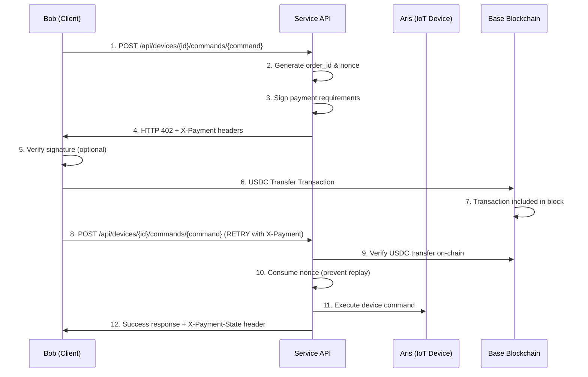

# x402 Enhanced API Specification

Base Mainnet USDC対応の強化されたx402プロトコルAPI仕様書

## 概要

本仕様書は、現在のxCockpitプロジェクトで実装されているx402（HTTP 402 Payment Required）プロトコルの強化版について説明します。Base Mainnet USDC、HMAC署名、nonce管理、オンチェーン検証などの本格的な機能が含まれています。

**重要**: 本実装は **x402標準準拠** の再送モデルを採用しており、同じリソースにX-Paymentヘッダーを付けて再送する方式を実装しています。

## バージョン情報

| 項目 | 値 |
|------|----| 
| API Version | v1.1 (Enhanced) |
| Protocol | x402-exact |
| Supported Networks | Base Mainnet (8453), Base Sepolia (84532) |
| Supported Tokens | USDC |
| Signature Algorithm | HMAC-SHA256 |

## 🔄 x402標準プロトコルフロー



## 📡 API エンドポイント

### デバイス制御要求 (初回)

**Endpoint**: `POST /api/devices/{deviceId}/commands/{command}`

**Parameters**:
- `deviceId` (string): デバイスID（例: ESP32_001, ESP32_002）
- `command` (string): 実行コマンド（例: dispense, reset）

**Request Headers**:
```http
Content-Type: application/json
Authorization: Bearer {access_token}
```

**Response (Payment Required)**:

```http
HTTP/1.1 402 Payment Required
Content-Type: application/json
WWW-Authenticate: Payment
X-Payment-Requirements: scheme="x402-exact", chain="eip155:8453", token="erc20:0x833589fCD6eDb6E08f4c7C32D4f71b54bdA02913", amount="0.01", currency="USDC", to="0x1c7d4b196cb0c7b01d743fbc6116a902379c7238", min_confirmations="0", order_id="ord_7QmZ3f", nonce="nx_9d8aef", nonce_exp="2025-09-01T09:05:00Z", callback="https://api.example.com/payhooks/base"
X-Payment-Signature: v1=a1b2c3d4e5f6789012345678901234567890abcdef1234567890abcdef123456

{
  "message": "Payment Required",
  "orderId": "ord_7QmZ3f",
  "nonce": "nx_9d8aef",
  "expiresAt": "2025-09-01T09:05:00Z",
  "payment": {
    "accepts": [{
      "scheme": "x402-exact",
      "network": "eip155:8453",
      "asset": "erc20:0x833589fCD6eDb6E08f4c7C32D4f71b54bdA02913",
      "amount": "0.01",
      "recipient": "0x1c7d4b196cb0c7b01d743fbc6116a902379c7238",
      "minConfirmations": 0
    }],
    "metadata": {
      "deviceId": "ESP32_001",
      "command": "dispense",
      "orderId": "ord_7QmZ3f",
      "timestamp": "2025-09-01T09:00:00Z"
    }
  }
}
```

### デバイス制御要求 (支払い証明付き再送) ⭐ x402標準準拠

**Endpoint**: `POST /api/devices/{deviceId}/commands/{command}` ※同じリソースに再送信

**Request Headers**:
```http
Content-Type: application/json
Authorization: Bearer {access_token}
X-Payment: base64(payment_data)
X-Payment-Requirements: {original_requirements_header}
X-Payment-Signature: {original_signature_header}
```

**X-Payment Header** (Base64エンコード前のデータ):
```json
{
  "amount": "0.01",
  "currency": "USDC",
  "network": "eip155:8453",
  "recipient": "0x1c7d4b196cb0c7b01d743fbc6116a902379c7238",
  "minConfirmations": 0,
  "metadata": {
    "orderId": "ord_7QmZ3f",
    "nonce": "nx_9d8aef",
    "txHash": "0x1234567890abcdef1234567890abcdef1234567890abcdef1234567890abcdef",
    "deviceId": "ESP32_001",
    "command": "dispense",
    "walletAddress": "0xuser_wallet_address"
  }
}
```

**Request Body** (オプション):
```json
{
  "walletAddress": "0xuser_wallet_address"
}
```

**Response (Success)**:
```http
HTTP/1.1 200 OK
Content-Type: application/json
X-Payment-State: paid; chain="eip155:8453"; tx_hash="0x1234567890abcdef1234567890abcdef1234567890abcdef1234567890abcdef"; confirmations="3"

{
  "result": "dispense",
  "deviceId": "ESP32_001",
  "paymentId": "pay_abc123",
  "txHash": "0x1234567890abcdef1234567890abcdef1234567890abcdef1234567890abcdef",
  "confirmations": 3,
  "amount": "0.01",
  "currency": "USDC",
  "timestamp": "2025-09-01T09:02:30Z",
  "expiresIn": 30
}
```

## 🔐 セキュリティヘッダー

### X-Payment-Requirements

支払い要件を含むヘッダー。以下のフィールドをカンマ区切りで含む：

| フィールド | 必須 | 説明 | 例 |
|-----------|------|------|----| 
| `scheme` | ✅ | 支払いスキーム | `"x402-exact"` |
| `chain` | ✅ | ブロックチェーンID | `"eip155:8453"` |
| `token` | ✅ | トークンアドレス | `"erc20:0x833589..."` |
| `amount` | ✅ | 支払い金額 | `"12.34"` |
| `currency` | ✅ | 通貨単位 | `"USDC"` |
| `to` | ✅ | 受取アドレス | `"0x1c7d4b..."` |
| `min_confirmations` | ✅ | 最小確認数 | `"0"` |
| `order_id` | ✅ | オーダーID | `"ord_7QmZ3f"` |
| `nonce` | ✅ | ワンタイムnonce | `"nx_9d8aef"` |
| `nonce_exp` | ✅ | nonce期限 | `"2025-09-01T09:05:00Z"` |
| `callback` | ❌ | コールバックURL | `"https://..."` |

### X-Payment-Signature

HMAC-SHA256署名ヘッダー：

```
X-Payment-Signature: v1={hex_encoded_hmac_sha256}
```

**署名データ**: X-Payment-Requirementsヘッダーの値
**アルゴリズム**: HMAC-SHA256
**秘密鍵**: サーバー側で管理される共有秘密

### X-Payment-State

支払い状態を示すレスポンスヘッダー：

```
X-Payment-State: paid; chain="eip155:8453"; tx_hash="0x..."; confirmations="3"
```

## 💰 料金体系

### デバイス別料金設定

| デバイスID | 基本料金 | 説明 |
|-----------|---------|------|
| `ESP32_001` | $0.01 USDC | Smart Gacha #001 |
| `ESP32_002` | $0.005 USDC | Smart Gacha #002 |
| その他 | $0.01 USDC | デフォルト料金 |

### 時間帯別料金

- **通常時間**: 基本料金
- **ピーク時間（18:00-22:00）**: 基本料金 × 1.5

### 確認数による料金調整

確認数によって料金調整はしませんが、推奨設定：

| 金額範囲 | 推奨確認数 | 理由 |
|---------|-----------|------|
| < $1 | 0 | 即時性重視 |
| $1-$10 | 2 | バランス |
| > $10 | 3 | 安全性重視 |

## 🔗 ネットワーク設定

### Base Mainnet (本番)

| 項目 | 値 |
|------|----| 
| Chain ID | 8453 |
| Network ID | `eip155:8453` |
| RPC URL | `https://mainnet.base.org` |
| USDC Contract | `0x833589fCD6eDb6E08f4c7C32D4f71b54bdA02913` |
| Explorer | `https://basescan.org` |

### Base Sepolia (開発/テスト)

| 項目 | 値 |
|------|----| 
| Chain ID | 84532 |
| Network ID | `eip155:84532` |
| RPC URL | `https://sepolia.base.org` |
| USDC Contract | `0x036CbD53842c5426634e7929541eC2318f3dCF7e` |
| Explorer | `https://sepolia.basescan.org` |

## 🔍 検証ロジック

### 段階的検証プロセス

1. **署名検証** (HMAC-SHA256)
   ```typescript
   const isValidSignature = signatureVerifier.verifyPaymentRequirements(
     requirementsHeader, 
     signatureHeader
   );
   ```

2. **Order/Nonce検証**
   ```typescript
   const orderValidation = orderManager.validateOrder(orderId, nonce);
   if (!orderValidation.valid) throw new Error(orderValidation.error);
   ```

3. **オンチェーン検証**
   ```typescript
   const blockchainResult = await blockchainVerifier.verifyUSDCTransfer({
     txHash,
     expectedTo: recipient,
     minAmount: amount,
     minConfirmations: minConfirmations || 0
   });
   ```

4. **Nonce消費** (リプレイ攻撃防止)
   ```typescript
   const consumed = orderManager.consumeOrder(orderId, nonce, txHash);
   ```

### フェイルセーフ機能

```typescript
// 段階的な機能有効化
if (process.env.ENHANCED_X402 !== 'true') {
  // 基本検証（後方互換性）
  return basicVerification(payment);
}

// ネットワーク自動選択
const network = process.env.NETWORK === 'mainnet' ? 'mainnet' : 'sepolia';
```

## ⚠️ エラーレスポンス

### 共通エラー形式

```json
{
  "error": {
    "code": "PAYMENT_VERIFICATION_FAILED",
    "message": "Blockchain verification failed: insufficient amount",
    "details": {
      "expected": "0.01",
      "actual": "0.005",
      "txHash": "0x..."
    }
  }
}
```

### エラーコード一覧

| コード | HTTP Status | 説明 |
|-------|-------------|------|
| `PAYMENT_REQUIRED` | 402 | 支払いが必要 |
| `INVALID_PAYMENT_HEADER` | 400 | X-Paymentヘッダー形式エラー |
| `INVALID_SIGNATURE` | 400 | 署名検証失敗 |
| `ORDER_NOT_FOUND` | 400 | オーダーが存在しない |
| `ORDER_EXPIRED` | 400 | オーダーが期限切れ |
| `ORDER_ALREADY_USED` | 400 | オーダーが既に使用済み |
| `INVALID_NONCE` | 400 | 無効なnonce |
| `TRANSACTION_NOT_FOUND` | 400 | トランザクションが見つからない |
| `TRANSACTION_FAILED` | 400 | トランザクション実行失敗 |
| `INSUFFICIENT_AMOUNT` | 400 | 支払い金額不足 |
| `INSUFFICIENT_CONFIRMATIONS` | 400 | 確認数不足 |
| `INVALID_RECIPIENT` | 400 | 受取アドレスが不正 |
| `BLOCKCHAIN_VERIFICATION_FAILED` | 500 | ブロックチェーン検証エラー |
| `DEVICE_COMMAND_FAILED` | 500 | デバイス制御失敗 |

### 詳細エラー例

#### 支払い金額不足
```json
{
  "error": {
    "code": "INSUFFICIENT_AMOUNT",
    "message": "Payment amount is insufficient",
    "details": {
      "required": "0.01",
      "received": "0.005",
      "difference": "0.005"
    }
  }
}
```

#### 確認数不足
```json
{
  "error": {
    "code": "INSUFFICIENT_CONFIRMATIONS",
    "message": "Transaction requires more confirmations",
    "details": {
      "current": 1,
      "required": 3,
      "estimated_wait": "30 seconds"
    }
  }
}
```

## 📊 レート制限

### API制限

| エンドポイント | 制限 | ウィンドウ |
|---------------|------|----------|
| デバイス制御要求 | 10回/分 | 1分 |
| 一般API | 100回/分 | 1分 |

### Order生成制限

- 同時アクティブOrder数: 5個/ユーザー
- Order生存期間: 5分（デフォルト）
- Nonce再利用防止: 永続（使用済みnonce）

## 🔧 開発者向けツール

### cURLでのテスト例

#### 1. デバイス制御要求 (初回)
```bash
curl -X POST http://localhost:5001/api/devices/ESP32_001/commands/dispense \
  -H "Content-Type: application/json" \
  -H "Authorization: Bearer your-token"
```

#### 2. x402標準準拠 支払い証明付き再送
```bash
# X-Paymentヘッダー用のBase64データ作成
PAYMENT_DATA='{"amount":"0.01","currency":"USDC","network":"eip155:8453","recipient":"0x1c7d4b196cb0c7b01d743fbc6116a902379c7238","metadata":{"orderId":"ord_7QmZ3f","nonce":"nx_9d8aef","txHash":"0x...","deviceId":"ESP32_001","command":"dispense"}}'
PAYMENT_B64=$(echo -n "$PAYMENT_DATA" | base64 -w 0)

curl -X POST http://localhost:5001/api/devices/ESP32_001/commands/dispense \
  -H "Content-Type: application/json" \
  -H "Authorization: Bearer your-token" \
  -H "X-Payment: $PAYMENT_B64" \
  -H "X-Payment-Requirements: scheme=\"x402-exact\", ..." \
  -H "X-Payment-Signature: v1=..." \
  -d '{"walletAddress": "0xuser_wallet_address"}'
```

### JavaScript SDKサンプル

```javascript
class X402Client {
  constructor(apiUrl, accessToken) {
    this.apiUrl = apiUrl;
    this.accessToken = accessToken;
  }
  
  async requestPayment(deviceId, command) {
    const response = await fetch(`${this.apiUrl}/api/devices/${deviceId}/commands/${command}`, {
      method: 'POST',
      headers: {
        'Authorization': `Bearer ${this.accessToken}`,
        'Content-Type': 'application/json'
      }
    });
    
    if (response.status === 402) {
      return {
        paymentRequired: true,
        requirements: response.headers.get('X-Payment-Requirements'),
        signature: response.headers.get('X-Payment-Signature'),
        data: await response.json()
      };
    }
    
    return await response.json();
  }
  
  async submitPayment(deviceId, command, paymentData, requirements, signature) {
    // x402標準準拠: 同じリソースに X-Payment ヘッダーを付けて再送
    const paymentHeader = btoa(JSON.stringify(paymentData));
    
    const response = await fetch(`${this.apiUrl}/api/devices/${deviceId}/commands/${command}`, {
      method: 'POST',
      headers: {
        'Authorization': `Bearer ${this.accessToken}`,
        'Content-Type': 'application/json',
        'X-Payment': paymentHeader,
        'X-Payment-Requirements': requirements,
        'X-Payment-Signature': signature
      },
      body: JSON.stringify({
        walletAddress: paymentData.metadata?.walletAddress
      })
    });
    
    return {
      success: response.ok,
      paymentState: response.headers.get('X-Payment-State'),
      data: await response.json()
    };
  }
}

// 使用例
const client = new X402Client('http://localhost:5001', 'your-token');

// Step 1: 支払い要求
const paymentRequest = await client.requestPayment('ESP32_001', 'dispense');
if (paymentRequest.paymentRequired) {
  console.log('Payment required:', paymentRequest.data);
  
  // Step 2: USDC支払い実行 (MetaMask等)
  // ...
  
  // Step 3: x402標準準拠 支払い証明再送
  const result = await client.submitPayment('ESP32_001', 'dispense', {
    amount: '0.01',
    currency: 'USDC',
    network: 'eip155:8453',
    recipient: '0x1c7d4b196cb0c7b01d743fbc6116a902379c7238',
    metadata: {
      orderId: paymentRequest.data.orderId,
      nonce: paymentRequest.data.nonce,
      txHash: '0x...',
      deviceId: 'ESP32_001',
      command: 'dispense',
      walletAddress: '0xuser_wallet_address'
    }
  }, paymentRequest.requirements, paymentRequest.signature);
  
  console.log('Payment result:', result);
}
```

## 🚀 本番運用チェックリスト

### セキュリティ
- [ ] HMAC秘密鍵が適切に生成・管理されている
- [ ] 本番用ウォレットアドレスが設定されている
- [ ] RPC エンドポイントが信頼できるプロバイダー
- [ ] HTTPS通信の強制
- [ ] レート制限の設定

### 監視
- [ ] 支払い成功率の監視
- [ ] ブロックチェーン応答時間の監視
- [ ] エラー率の監視
- [ ] ウォレット残高の監視

### バックアップ
- [ ] 設定ファイルのバックアップ
- [ ] ウォレット秘密鍵のセキュアな保管
- [ ] ログのローテーション設定

---

**本API仕様書は、x402標準準拠の強化版実装に関する完全なガイドです。同じリソースへの再送方式により、真のx402プロトコル互換性を実現しています。**