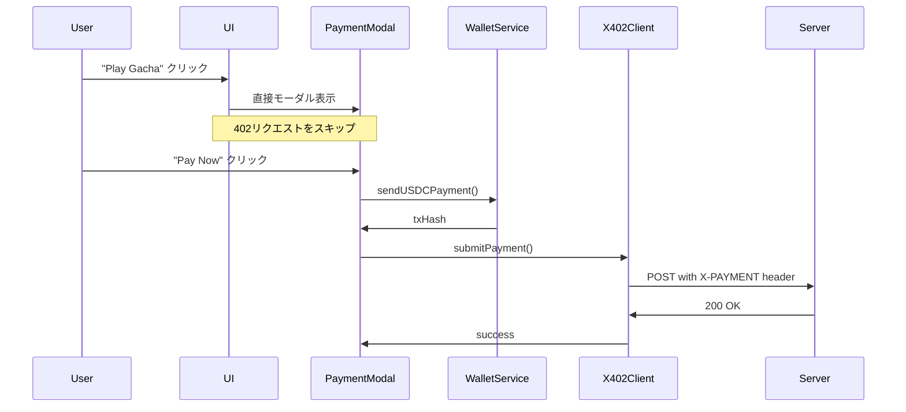
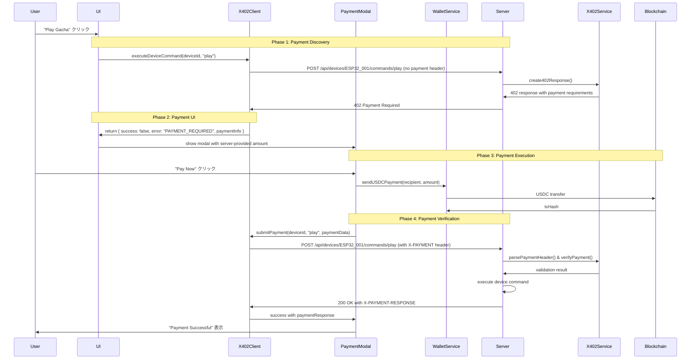

# x402 Implementation Status & Handoff Guide

## 📋 Current Implementation Status

### ✅ Completed Features

#### 1. Basic x402 Protocol Flow
- **HTTP 402 Payment Required** response generation
- **X-PAYMENT header** processing for payment submission
- **X-PAYMENT-RESPONSE header** for payment confirmation
- **Two-phase payment flow**: Initial request → 402 response → Payment submission → Success

#### 2. Device-Specific Pricing
- **Fixed pricing logic** with device-specific amounts:
  - `ESP32_001`: $0.01 USDC
  - `ESP32_002`: $0.005 USDC
- **Peak hour multiplier** (6PM-10PM: 1.5x price)
- **Dynamic pricing calculation** in `X402Service.calculateDevicePrice()`

#### 3. Frontend x402 Client
- **X402Client class** for handling payment flows
- **402 response parsing** and payment info extraction
- **Payment header creation** and submission
- **Error handling** for various response scenarios

#### 4. Backend x402 Service
- **Payment header validation** and parsing
- **Payment response generation**
- **Basic payment verification** (field presence check)
- **Integration with device command execution**

#### 5. Payment Modal Integration
- **Direct USDC payment** processing via Coinbase Wallet
- **x402 flow integration** with payment modal
- **Transaction confirmation** and balance updates
- **Enhanced debugging logs** for payment tracking

### 🚨 Critical Missing Implementations

#### 1. **Blockchain Transaction Verification** (HIGHEST PRIORITY)
**Location**: `/home/runner/workspace/server/services/x402.ts:90-94`

```typescript
static async verifyPayment(payment: X402PaymentRequest): Promise<boolean> {
  // ❌ CURRENT: Basic field validation only
  return !!(payment.amount && payment.currency && payment.network && payment.metadata?.txHash);
  
  // ✅ NEEDS: Actual blockchain verification
  // TODO: Implement Web3 transaction verification
  // 1. Connect to Base Sepolia RPC
  // 2. Verify transaction hash exists
  // 3. Check transaction amount matches
  // 4. Verify recipient address
  // 5. Confirm transaction success
}
```

**Implementation Requirements**:
- Install `ethers` or `web3.js`
- Add Base Sepolia RPC endpoint
- Implement transaction receipt verification
- Validate USDC transfer amount and recipient

#### 2. **Payment Recipient Address Fix**
**Location**: `/home/runner/workspace/client/src/lib/x402-client.ts:157`

```typescript
// ❌ CURRENT: Wrong recipient (sender's wallet)
recipient: paymentData.walletAddress,

// ✅ SHOULD BE: Actual payment recipient
recipient: '0x1c7d4b196cb0c7b01d743fbc6116a902379c7238', // or from payment info
```

#### 3. **Double-Spending Prevention**
- **Payment tracking database** to prevent duplicate payments
- **Nonce/unique ID system** for each payment request
- **Timestamp validation** to prevent replay attacks

#### 4. **Enhanced Error Handling**
- **Gas estimation failures**
- **Network connectivity issues**
- **Transaction timeout handling**
- **Insufficient balance scenarios**

## 🏗️ Architecture Overview

### Payment Flow Sequence
```
1. User clicks device action
2. Frontend: POST /api/devices/{id}/commands/{command} (no X-PAYMENT header)
3. Backend: Returns 402 with payment requirements
4. Frontend: Shows PaymentModal with pricing
5. User: Confirms payment via Coinbase Wallet
6. Frontend: Sends USDC transaction on blockchain
7. Frontend: POST /api/devices/{id}/commands/{command} (with X-PAYMENT header)
8. Backend: Verifies payment and executes command
9. Backend: Returns success with X-PAYMENT-RESPONSE header
10. Frontend: Updates balance and shows success
```

### Key Files

#### Backend
- `server/services/x402.ts` - Core x402 service and verification
- `server/routes.ts:41-117` - Device command endpoint with x402 flow
- `server/services/payment.ts` - Payment processing and database storage
- `server/services/websocket.ts` - Device communication

#### Frontend  
- `client/src/lib/x402-client.ts` - x402 protocol client
- `client/src/components/payment-modal.tsx` - Payment UI and flow
- `client/src/lib/coinbase-wallet.ts` - Blockchain payment execution
- `client/src/pages/dashboard.tsx` - Device interaction UI

## 🛠️ Development Environment

### Prerequisites
- Node.js 20+
- Base Sepolia testnet access
- USDC on Base Sepolia for testing
- Coinbase Wallet with Base Sepolia network

### Environment Variables
```bash
# Backend (.env)
PORT=5001
PAYMENT_RECIPIENT=0x1c7d4b196cb0c7b01d743fbc6116a902379c7238
DATABASE_URL=sqlite:./database.db

# Frontend (.env)
VITE_BACKEND_PORT=5001
VITE_USDC_CONTRACT_ADDRESS=0x036CbD53842c5426634e7929541eC2318f3dCF7e
```

### Running the Application
```bash
# Terminal 1: Backend
PORT=5001 npm run dev

# Terminal 2: Frontend  
VITE_BACKEND_PORT=5001 npx vite --port 3000
```

## 🚧 Immediate Next Steps (Priority Order)

### 1. Implement Blockchain Verification (Critical)
```typescript
// Add to server/services/x402.ts
import { ethers } from 'ethers';

const provider = new ethers.JsonRpcProvider('https://sepolia.base.org');
const USDC_ADDRESS = '0x036CbD53842c5426634e7929541eC2318f3dCF7e';

static async verifyPayment(payment: X402PaymentRequest): Promise<boolean> {
  try {
    const txHash = payment.metadata?.txHash;
    if (!txHash) return false;
    
    // Get transaction receipt
    const receipt = await provider.getTransactionReceipt(txHash);
    if (!receipt || receipt.status !== 1) return false;
    
    // Verify USDC transfer amount and recipient
    // Parse transfer logs and validate
    
    return true;
  } catch (error) {
    console.error('Payment verification failed:', error);
    return false;
  }
}
```

### 2. Fix Payment Recipient Address
- Update `X402Client.submitPayment()` to use correct recipient
- Ensure consistency between 402 response and payment submission

### 3. Add Payment Deduplication
```typescript
// Add payment tracking to prevent double-spending
static async verifyPayment(payment: X402PaymentRequest): Promise<boolean> {
  // Check if transaction hash already processed
  const existingPayment = await storage.getPaymentByTxHash(payment.metadata.txHash);
  if (existingPayment) {
    console.warn('Payment already processed:', payment.metadata.txHash);
    return false;
  }
  
  // Continue with blockchain verification...
}
```

### 4. Enhanced Error Handling
- Add specific error messages for common failure scenarios
- Implement retry logic for network timeouts
- Add gas estimation with buffer for reliable transactions

## 📊 Testing Strategy

### Unit Tests Needed
- `X402Service.verifyPayment()` with mock blockchain responses
- `X402Client` payment flow simulation
- Payment modal user interaction flows

### Integration Tests
- End-to-end payment flow with testnet
- Device command execution after payment
- Error scenarios (insufficient balance, network failures)

### Manual Testing Checklist
- [ ] ESP32_001 payment ($0.01 USDC)
- [ ] ESP32_002 payment ($0.005 USDC) 
- [ ] Peak hour pricing (1.5x multiplier)
- [ ] Balance updates after payment
- [ ] Transaction history recording
- [ ] Error handling for failed payments
- [ ] Double-payment prevention

## 🔒 Security Considerations

### Current Vulnerabilities
1. **No blockchain verification** - payments not actually validated
2. **Replay attack possibility** - no nonce/timestamp validation
3. **Amount manipulation** - no server-side amount verification
4. **Recipient spoofing** - incorrect recipient in payment header

### Recommended Security Enhancements
1. **Server-side amount calculation** - never trust client pricing
2. **Timestamp validation** - reject old payment requests
3. **Rate limiting** - prevent spam payment attempts
4. **Payment expiry** - time-bound payment requests
5. **Audit logging** - comprehensive payment attempt logging

## 📈 Future Enhancements

### Protocol Extensions
- **Multi-asset payments** (ETH, other ERC-20 tokens)
- **Batch payments** for multiple device actions
- **Subscription payments** for ongoing access
- **Dynamic pricing** based on device load/availability

### User Experience
- **Payment preauthorization** to avoid repeated confirmations
- **Balance caching** for faster UI updates
- **Payment history export**
- **Spending analytics and insights**

### Integration Opportunities
- **Other wallet providers** (MetaMask, WalletConnect)
- **Layer 2 solutions** for lower transaction costs
- **Cross-chain payments** via bridges
- **Fiat on-ramps** for easier USDC acquisition

---

## 📞 Contact & Handoff Notes

**Current Status**: x402 protocol foundation complete, blockchain verification pending
**Estimated Completion**: 2-3 days for full implementation
**Risk Level**: Medium (functional for testing, needs security hardening for production)

**Key Decision Points**:
1. Choose Web3 library (ethers.js recommended)
2. Determine payment verification timeout (suggest 30 seconds)
3. Define error retry strategy and limits
4. Plan database schema for payment deduplication

This implementation provides a solid foundation for x402-based IoT payments but requires the critical blockchain verification component before production deployment.
## 🎯 Recent Fixes & Improvements Completed

### Balance Precision Fix
- **Issue**: 0.0005 USDC changes weren't reflected in UI despite blockchain confirmation
- **Fix**: Changed `getUSDCBalance()` from `toFixed(2)` to `toFixed(4)` precision
- **Files**: `client/src/lib/coinbase-wallet.ts:142, 218`
- **Result**: UI now properly displays small balance changes

### Device Pricing Correction
- **Issue**: ESP32_002 showed $0.010 instead of $0.005
- **Fix**: Updated X402Service with device-specific pricing map
- **Files**: `server/services/x402.ts:21-24`
- **Result**: Correct pricing displayed in UI and API responses

### Transaction History Fix
- **Issue**: Recent Transactions not displaying payment history
- **Fix**: Changed from non-existent `/api/users` to `/api/payments` endpoint
- **Files**: `client/src/pages/dashboard.tsx:34-55`
- **Result**: Payment history properly loads with 404 graceful handling

### UI Improvements
- **Payment Status Component**: Removed static component (was showing only "No active payments")
- **Connect Wallet Button**: Centered text alignment for better UX
- **Balance Display**: Updated to show 4 decimal places (0.0000 format)

## 🔥 Critical Implementation Issues Still Remaining

### 1. **Payment Recipient Address Mismatch**
**Current Issue**: Payment header incorrectly uses sender's wallet address as recipient

```typescript
// ❌ INCORRECT - client/src/lib/x402-client.ts:157
recipient: paymentData.walletAddress, // This is the sender, not recipient!

// ✅ SHOULD BE:
recipient: paymentRecipient, // From 402 response or environment variable
```

### 2. **No Actual Blockchain Verification**
**Current Issue**: Server only checks if txHash field exists, doesn't verify on-chain

```typescript
// ❌ CURRENT - server/services/x402.ts:90-94  
static async verifyPayment(payment: X402PaymentRequest): Promise<boolean> {
  // Only checks if fields exist, no blockchain verification
  return !!(payment.amount && payment.currency && payment.network && payment.metadata?.txHash);
}
```

### 3. **Security Vulnerabilities**
- No double-spending protection
- No transaction amount verification
- No replay attack prevention  
- No payment expiry validation

## 📋 Working Implementation Status

### ✅ What's Currently Working



### 問題点

1. **標準非準拠**: 最初の402レスポンス取得がない
2. **価格発見の欠如**: サーバーから動的な価格情報を取得していない
3. **エラーハンドリング不足**: 支払い要求の検証プロセスがない
4. **柔軟性の欠如**: デバイス状態に応じた動的価格設定ができない

### 現在のコード構造

```typescript
// dashboard.tsx - 現在の実装
const handleDeviceCommand = (device: Device, command: string) => {
  if (!walletAddress) {
    alert('Please connect your wallet first');
    return;
  }
  
  // 静的価格を使用
  const deviceMetadata = device.metadata as { price?: string } | null;
  const amount = deviceMetadata?.price || '10.00';
  
  // 直接PaymentModalを表示（402プロセスをスキップ）
  setPaymentModalData({ device, command, amount });
};
```

## 完全なx402フロー（実装後）

### HTTP 402 Payment Required プロトコル

HTTP 402は「Payment Required」を示すステータスコードで、クライアントがリソースにアクセスするために支払いが必要であることを示します。

### 完全フローの概要



### 利点

1. **標準準拠**: HTTP 402プロトコルに完全準拠
2. **動的価格設定**: サーバー側で価格を動的に決定可能
3. **支払い検証**: トランザクションの完全な検証プロセス
4. **エラーハンドリング**: 各段階での適切なエラー処理
5. **拡張性**: 様々な支払い方法や通貨への対応が容易

## 実装に必要な変更

### 1. X402Client の拡張

```typescript
// client/src/lib/x402-client.ts - 追加が必要な部分

export class X402Client {
  // 新規追加: 初期リクエスト（402レスポンス取得）
  static async executeDeviceCommand(
    deviceId: string, 
    command: string, 
    walletAddress: string
  ): Promise<{
    success: boolean;
    paymentRequired?: boolean;
    paymentInfo?: {
      amount: string;
      currency: string;
      network: string;
      recipient: string;
    };
    payment?: PaymentResponse;
    error?: string;
  }> {
    try {
      // Phase 1: 支払いヘッダーなしでリクエスト
      const response = await apiRequest('POST', `/api/devices/${deviceId}/commands/${command}`, {
        walletAddress
      });

      // 支払いが不要な場合（既に支払い済みなど）
      const paymentResponseHeader = response.headers.get('X-PAYMENT-RESPONSE');
      if (paymentResponseHeader) {
        const paymentResponse = JSON.parse(atob(paymentResponseHeader));
        return { success: true, payment: paymentResponse };
      }

      return { success: true };

    } catch (error: any) {
      // 402 Payment Required の処理
      if (error.status === 402) {
        const paymentInfo = this.parse402Response(error.response);
        return {
          success: false,
          paymentRequired: true,
          paymentInfo
        };
      }
      
      return { success: false, error: error.message };
    }
  }

  // 新規追加: 402レスポンスの解析
  private static parse402Response(response: any): {
    amount: string;
    currency: string;
    network: string;
    recipient: string;
  } {
    const payment = response.body?.payment;
    if (payment?.accepts && payment.accepts.length > 0) {
      const acceptedPayment = payment.accepts[0];
      return {
        amount: acceptedPayment.amount,
        currency: 'USDC', // acceptedPayment.asset から推測
        network: acceptedPayment.network,
        recipient: acceptedPayment.recipient
      };
    }
    
    // フォールバック値
    return {
      amount: '0.01',
      currency: 'USDC',
      network: 'eip155:84532',
      recipient: '0x1c7d4b196cb0c7b01d743fbc6116a902379c7238'
    };
  }

  // 既存のsubmitPayment()は変更なし
}
```

### 2. Dashboard コンポーネントの変更

```typescript
// client/src/pages/dashboard.tsx - 変更が必要な部分

export default function Dashboard() {
  // 新規追加: 支払い状態管理
  const [paymentState, setPaymentState] = useState<'idle' | 'checking' | 'payment_required' | 'processing'>('idle');

  // 変更: handleDeviceCommand の完全書き換え
  const handleDeviceCommand = async (device: Device, command: string) => {
    if (!walletAddress) {
      alert('Please connect your wallet first');
      return;
    }

    setPaymentState('checking');

    try {
      // Phase 1: x402フローでの初期リクエスト
      const result = await X402Client.executeDeviceCommand(device.id, command, walletAddress);

      if (result.success) {
        // 支払い不要（既に支払い済みまたは無料操作）
        console.log('Command executed successfully:', result.payment);
        setPaymentState('idle');
        return;
      }

      if (result.paymentRequired && result.paymentInfo) {
        // Phase 2: 支払いが必要 - PaymentModalを表示
        setPaymentModalData({
          device,
          command,
          amount: result.paymentInfo.amount,
          recipient: result.paymentInfo.recipient
        });
        setPaymentState('payment_required');
      } else {
        // エラーケース
        console.error('Device command failed:', result.error);
        alert(result.error || 'Command failed');
        setPaymentState('idle');
      }
    } catch (error) {
      console.error('Device command error:', error);
      alert('Failed to execute command');
      setPaymentState('idle');
    }
  };

  // PaymentModalData の型も更新が必要
  const [paymentModalData, setPaymentModalData] = useState<{
    device: Device;
    command: string;
    amount: string;
    recipient: string; // 新規追加
  } | null>(null);
};
```

### 3. PaymentModal コンポーネントの変更

```typescript
// client/src/components/payment-modal.tsx - 変更が必要な部分

interface PaymentModalProps {
  device: Device;
  command: string;
  amount: string;
  recipient: string; // 新規追加: サーバーから取得したrecipient
  walletAddress: string;
  onClose: () => void;
}

export default function PaymentModal({ 
  device, 
  command, 
  amount, 
  recipient, // サーバーから受け取った値を使用
  walletAddress, 
  onClose 
}: PaymentModalProps) {
  
  const paymentMutation = useMutation({
    mutationFn: async () => {
      setPaymentStatus('processing');
      setPaymentError(null);

      try {
        // recipient は props から使用（環境変数ではなく）
        console.log(`💰 Starting USDC payment:`, {
          recipient, // サーバー指定の送金先
          amount,
          walletAddress,
          device: device.name
        });
        
        // Phase 3: USDC支払い実行
        setPaymentStatus('confirming');
        const txHash = await walletService.sendUSDCPayment(recipient, amount);
        
        console.log(`✅ Payment transaction submitted:`, txHash);
        
        // Phase 4: x402経由で支払い検証
        const result = await X402Client.submitPayment(device.id, command, {
          amount,
          currency: 'USDC',
          network: 'eip155:84532',
          txHash,
          walletAddress
        });

        if (!result.success) {
          throw new Error(result.error || 'Payment verification failed');
        }

        setPaymentStatus('completed');
        // ... 以下は既存と同じ
      } catch (error: any) {
        setPaymentStatus('error');
        setPaymentError(error.message);
        throw error;
      }
    }
  });
};
```

### 4. サーバーサイドの変更

```typescript
// server/services/x402.ts - 追加が必要な部分

export class X402Service {
  // 新規追加: 動的価格計算
  static calculateDevicePrice(deviceId: string, command: string): string {
    // デバイスタイプや時間帯に基づく動的価格設定
    const basePrice = {
      'gacha': '0.01',
      'lock': '0.005',
      'light': '0.001'
    };
    
    // 時間帯や需要に応じた価格調整ロジック
    // 例: ピーク時間は価格上昇
    const hour = new Date().getHours();
    const peakHourMultiplier = (hour >= 18 && hour <= 22) ? 1.5 : 1.0;
    
    const device = getDeviceById(deviceId);
    const deviceType = device?.type || 'gacha';
    const price = parseFloat(basePrice[deviceType] || '0.01') * peakHourMultiplier;
    
    return price.toFixed(3);
  }

  // 変更: create402Response に動的価格設定を追加
  static create402Response(deviceId: string, command: string): any {
    const amount = this.calculateDevicePrice(deviceId, command);
    const recipient = process.env.PAYMENT_RECIPIENT || '0x1c7d4b196cb0c7b01d743fbc6116a902379c7238';
    
    return {
      status: 402,
      headers: {
        'Content-Type': 'application/json',
        'WWW-Authenticate': 'Payment'
      },
      body: {
        message: 'Payment Required',
        payment: {
          accepts: [{
            scheme: 'exact',
            network: 'eip155:84532', // Base Sepolia
            asset: '0x036CbD53842c5426634e7929541eC2318f3dCF7e', // USDC
            amount: amount,
            recipient: recipient
          }],
          metadata: {
            deviceId,
            command,
            timestamp: new Date().toISOString()
          }
        }
      }
    };
  }
}
```

### 5. ルートハンドラーの変更

```typescript
// server/routes.ts - 変更が必要な部分

// デバイスコマンド実行エンドポイント
router.post('/api/devices/:id/commands/:command', async (req, res) => {
  try {
    const { id: deviceId, command } = req.params;
    const { walletAddress } = req.body;
    const paymentHeader = req.headers['x-payment'] as string;

    // Phase 1: 支払いヘッダーがない場合は402を返す
    if (!paymentHeader) {
      const response = X402Service.create402Response(deviceId, command);
      return res.status(402).json(response.body);
    }

    // Phase 2: 支払いヘッダーの検証
    const payment = X402Service.parsePaymentHeader(paymentHeader);
    if (!payment) {
      return res.status(400).json({ message: 'Invalid payment header' });
    }

    // Phase 3: 支払いの検証
    const isValid = await X402Service.verifyPayment(payment);
    if (!isValid) {
      return res.status(402).json({ message: 'Payment verification failed' });
    }

    // Phase 4: デバイスコマンドの実行
    const device = await executeDeviceCommand(deviceId, command);
    
    // Phase 5: 支払いレスポンスヘッダーの生成
    const paymentResponse = X402Service.createPaymentResponse(payment, generatePaymentId());
    const responseHeader = Buffer.from(JSON.stringify(paymentResponse)).toString('base64');
    
    res.setHeader('X-PAYMENT-RESPONSE', responseHeader);
    res.json({
      success: true,
      device,
      payment: paymentResponse
    });

  } catch (error) {
    console.error('Device command error:', error);
    res.status(500).json({ message: 'Internal server error' });
  }
});
```

## シーケンス図の比較

### 現在の実装（簡素化）
```
User → UI → PaymentModal → WalletService → Blockchain → Server
     (直接)    (Static Price)     (USDC Transfer)      (Payment Verify)
```

### 完全x402実装（標準準拠）
```
User → UI → X402Client → Server → X402Client → UI → PaymentModal → WalletService → Blockchain
     (Click)  (No Payment)  (402)   (Payment Info)  (Modal) (Dynamic Price) (USDC Transfer)
                                                                                    ↓
Server ← X402Client ← PaymentModal ← WalletService ← Blockchain
(Verify)  (With Payment Header)        (Success)         (txHash)
```

## 実装手順

### Step 1: X402Client の拡張
1. `executeDeviceCommand` メソッドを追加
2. `parse402Response` メソッドを追加  
3. エラーハンドリングの改善

### Step 2: Dashboard の変更
1. `handleDeviceCommand` を非同期処理に変更
2. 支払い状態管理を追加
3. PaymentModalData型を更新

### Step 3: PaymentModal の更新
1. Props に `recipient` を追加
2. サーバー指定の送金先を使用
3. 動的価格表示の対応

### Step 4: サーバーサイドの拡張
1. `calculateDevicePrice` メソッドを追加
2. `create402Response` を動的価格対応に変更
3. ルートハンドラーで402フローを実装

### Step 5: テストとデバッグ
1. 各フェーズのログ出力を追加
2. エラーケースのテスト
3. トランザクション検証の確認

## テスト方法

### 1. Phase 1 テスト (Payment Discovery)
```bash
curl -X POST http://localhost:5000/api/devices/ESP32_001/commands/play \
  -H "Content-Type: application/json" \
  -d '{"walletAddress":"0x1234..."}'

# 期待: 402 Payment Required レスポンス
```

### 2. Phase 2 テスト (Payment Modal)
- UI でデバイスをクリック
- PaymentModal が402レスポンスの価格で表示されることを確認

### 3. Phase 3 テスト (Payment Execution)
- "Pay Now" ボタンをクリック
- Coinbase Wallet でトランザクション確認
- txHash が取得されることを確認

### 4. Phase 4 テスト (Payment Verification)
```bash
curl -X POST http://localhost:5000/api/devices/ESP32_001/commands/play \
  -H "Content-Type: application/json" \
  -H "X-PAYMENT: <base64-encoded-payment-data>" \
  -d '{"walletAddress":"0x1234..."}'

# 期待: 200 OK with X-PAYMENT-RESPONSE header
```

### 5. End-to-End テスト
1. ウォレット接続
2. デバイスクリック
3. 支払い実行
4. 成功メッセージ確認
5. トランザクション履歴確認

## まとめ

完全なx402実装により以下が実現されます：

- ✅ HTTP 402プロトコル標準準拠
- ✅ 動的価格設定機能
- ✅ 包括的支払い検証
- ✅ 改善されたエラーハンドリング
- ✅ 拡張可能なアーキテクチャ

この実装により、xCockpitはより堅牢で標準準拠のWeb3 IoT決済ゲートウェイになります。