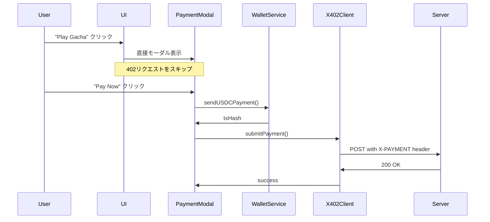
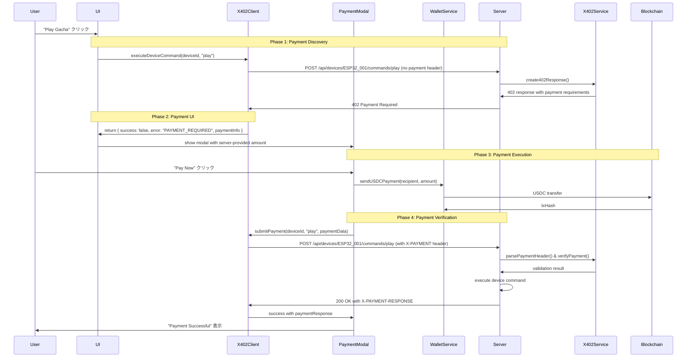

# x402 Payment Protocol Implementation Guide

## 概要

このドキュメントでは、xCockpitアプリケーションにおけるHTTP 402 Payment Required プロトコルの完全実装について説明します。現在の簡素化されたフローから、標準的なx402フローへの移行手順を記載しています。

## 目次

1. [現在の実装（実装前）](#現在の実装実装前)
2. [完全なx402フロー（実装後）](#完全なx402フロー実装後)
3. [実装に必要な変更](#実装に必要な変更)
4. [シーケンス図の比較](#シーケンス図の比較)
5. [実装手順](#実装手順)
6. [テスト方法](#テスト方法)

## 現在の実装（実装前）

### フロー概要

現在のxCockpitは簡素化されたフローを使用しており、HTTP 402プロトコルの標準に完全に準拠していません：



### 問題点

1. **標準非準拠**: 最初の402レスポンス取得がない
2. **価格発見の欠如**: サーバーから動的な価格情報を取得していない
3. **エラーハンドリング不足**: 支払い要求の検証プロセスがない
4. **柔軟性の欠如**: デバイス状態に応じた動的価格設定ができない

### 現在のコード構造

```typescript
// dashboard.tsx - 現在の実装
const handleDeviceCommand = (device: Device, command: string) => {
  if (!walletAddress) {
    alert('Please connect your wallet first');
    return;
  }
  
  // 静的価格を使用
  const deviceMetadata = device.metadata as { price?: string } | null;
  const amount = deviceMetadata?.price || '10.00';
  
  // 直接PaymentModalを表示（402プロセスをスキップ）
  setPaymentModalData({ device, command, amount });
};
```

## 完全なx402フロー（実装後）

### HTTP 402 Payment Required プロトコル

HTTP 402は「Payment Required」を示すステータスコードで、クライアントがリソースにアクセスするために支払いが必要であることを示します。

### 完全フローの概要



### 利点

1. **標準準拠**: HTTP 402プロトコルに完全準拠
2. **動的価格設定**: サーバー側で価格を動的に決定可能
3. **支払い検証**: トランザクションの完全な検証プロセス
4. **エラーハンドリング**: 各段階での適切なエラー処理
5. **拡張性**: 様々な支払い方法や通貨への対応が容易

## 実装に必要な変更

### 1. X402Client の拡張

```typescript
// client/src/lib/x402-client.ts - 追加が必要な部分

export class X402Client {
  // 新規追加: 初期リクエスト（402レスポンス取得）
  static async executeDeviceCommand(
    deviceId: string, 
    command: string, 
    walletAddress: string
  ): Promise<{
    success: boolean;
    paymentRequired?: boolean;
    paymentInfo?: {
      amount: string;
      currency: string;
      network: string;
      recipient: string;
    };
    payment?: PaymentResponse;
    error?: string;
  }> {
    try {
      // Phase 1: 支払いヘッダーなしでリクエスト
      const response = await apiRequest('POST', `/api/devices/${deviceId}/commands/${command}`, {
        walletAddress
      });

      // 支払いが不要な場合（既に支払い済みなど）
      const paymentResponseHeader = response.headers.get('X-PAYMENT-RESPONSE');
      if (paymentResponseHeader) {
        const paymentResponse = JSON.parse(atob(paymentResponseHeader));
        return { success: true, payment: paymentResponse };
      }

      return { success: true };

    } catch (error: any) {
      // 402 Payment Required の処理
      if (error.status === 402) {
        const paymentInfo = this.parse402Response(error.response);
        return {
          success: false,
          paymentRequired: true,
          paymentInfo
        };
      }
      
      return { success: false, error: error.message };
    }
  }

  // 新規追加: 402レスポンスの解析
  private static parse402Response(response: any): {
    amount: string;
    currency: string;
    network: string;
    recipient: string;
  } {
    const payment = response.body?.payment;
    if (payment?.accepts && payment.accepts.length > 0) {
      const acceptedPayment = payment.accepts[0];
      return {
        amount: acceptedPayment.amount,
        currency: 'USDC', // acceptedPayment.asset から推測
        network: acceptedPayment.network,
        recipient: acceptedPayment.recipient
      };
    }
    
    // フォールバック値
    return {
      amount: '0.01',
      currency: 'USDC',
      network: 'eip155:84532',
      recipient: '0x1c7d4b196cb0c7b01d743fbc6116a902379c7238'
    };
  }

  // 既存のsubmitPayment()は変更なし
}
```

### 2. Dashboard コンポーネントの変更

```typescript
// client/src/pages/dashboard.tsx - 変更が必要な部分

export default function Dashboard() {
  // 新規追加: 支払い状態管理
  const [paymentState, setPaymentState] = useState<'idle' | 'checking' | 'payment_required' | 'processing'>('idle');

  // 変更: handleDeviceCommand の完全書き換え
  const handleDeviceCommand = async (device: Device, command: string) => {
    if (!walletAddress) {
      alert('Please connect your wallet first');
      return;
    }

    setPaymentState('checking');

    try {
      // Phase 1: x402フローでの初期リクエスト
      const result = await X402Client.executeDeviceCommand(device.id, command, walletAddress);

      if (result.success) {
        // 支払い不要（既に支払い済みまたは無料操作）
        console.log('Command executed successfully:', result.payment);
        setPaymentState('idle');
        return;
      }

      if (result.paymentRequired && result.paymentInfo) {
        // Phase 2: 支払いが必要 - PaymentModalを表示
        setPaymentModalData({
          device,
          command,
          amount: result.paymentInfo.amount,
          recipient: result.paymentInfo.recipient
        });
        setPaymentState('payment_required');
      } else {
        // エラーケース
        console.error('Device command failed:', result.error);
        alert(result.error || 'Command failed');
        setPaymentState('idle');
      }
    } catch (error) {
      console.error('Device command error:', error);
      alert('Failed to execute command');
      setPaymentState('idle');
    }
  };

  // PaymentModalData の型も更新が必要
  const [paymentModalData, setPaymentModalData] = useState<{
    device: Device;
    command: string;
    amount: string;
    recipient: string; // 新規追加
  } | null>(null);
};
```

### 3. PaymentModal コンポーネントの変更

```typescript
// client/src/components/payment-modal.tsx - 変更が必要な部分

interface PaymentModalProps {
  device: Device;
  command: string;
  amount: string;
  recipient: string; // 新規追加: サーバーから取得したrecipient
  walletAddress: string;
  onClose: () => void;
}

export default function PaymentModal({ 
  device, 
  command, 
  amount, 
  recipient, // サーバーから受け取った値を使用
  walletAddress, 
  onClose 
}: PaymentModalProps) {
  
  const paymentMutation = useMutation({
    mutationFn: async () => {
      setPaymentStatus('processing');
      setPaymentError(null);

      try {
        // recipient は props から使用（環境変数ではなく）
        console.log(`💰 Starting USDC payment:`, {
          recipient, // サーバー指定の送金先
          amount,
          walletAddress,
          device: device.name
        });
        
        // Phase 3: USDC支払い実行
        setPaymentStatus('confirming');
        const txHash = await walletService.sendUSDCPayment(recipient, amount);
        
        console.log(`✅ Payment transaction submitted:`, txHash);
        
        // Phase 4: x402経由で支払い検証
        const result = await X402Client.submitPayment(device.id, command, {
          amount,
          currency: 'USDC',
          network: 'eip155:84532',
          txHash,
          walletAddress
        });

        if (!result.success) {
          throw new Error(result.error || 'Payment verification failed');
        }

        setPaymentStatus('completed');
        // ... 以下は既存と同じ
      } catch (error: any) {
        setPaymentStatus('error');
        setPaymentError(error.message);
        throw error;
      }
    }
  });
};
```

### 4. サーバーサイドの変更

```typescript
// server/services/x402.ts - 追加が必要な部分

export class X402Service {
  // 新規追加: 動的価格計算
  static calculateDevicePrice(deviceId: string, command: string): string {
    // デバイスタイプや時間帯に基づく動的価格設定
    const basePrice = {
      'gacha': '0.01',
      'lock': '0.005',
      'light': '0.001'
    };
    
    // 時間帯や需要に応じた価格調整ロジック
    // 例: ピーク時間は価格上昇
    const hour = new Date().getHours();
    const peakHourMultiplier = (hour >= 18 && hour <= 22) ? 1.5 : 1.0;
    
    const device = getDeviceById(deviceId);
    const deviceType = device?.type || 'gacha';
    const price = parseFloat(basePrice[deviceType] || '0.01') * peakHourMultiplier;
    
    return price.toFixed(3);
  }

  // 変更: create402Response に動的価格設定を追加
  static create402Response(deviceId: string, command: string): any {
    const amount = this.calculateDevicePrice(deviceId, command);
    const recipient = process.env.PAYMENT_RECIPIENT || '0x1c7d4b196cb0c7b01d743fbc6116a902379c7238';
    
    return {
      status: 402,
      headers: {
        'Content-Type': 'application/json',
        'WWW-Authenticate': 'Payment'
      },
      body: {
        message: 'Payment Required',
        payment: {
          accepts: [{
            scheme: 'exact',
            network: 'eip155:84532', // Base Sepolia
            asset: '0x036CbD53842c5426634e7929541eC2318f3dCF7e', // USDC
            amount: amount,
            recipient: recipient
          }],
          metadata: {
            deviceId,
            command,
            timestamp: new Date().toISOString()
          }
        }
      }
    };
  }
}
```

### 5. ルートハンドラーの変更

```typescript
// server/routes.ts - 変更が必要な部分

// デバイスコマンド実行エンドポイント
router.post('/api/devices/:id/commands/:command', async (req, res) => {
  try {
    const { id: deviceId, command } = req.params;
    const { walletAddress } = req.body;
    const paymentHeader = req.headers['x-payment'] as string;

    // Phase 1: 支払いヘッダーがない場合は402を返す
    if (!paymentHeader) {
      const response = X402Service.create402Response(deviceId, command);
      return res.status(402).json(response.body);
    }

    // Phase 2: 支払いヘッダーの検証
    const payment = X402Service.parsePaymentHeader(paymentHeader);
    if (!payment) {
      return res.status(400).json({ message: 'Invalid payment header' });
    }

    // Phase 3: 支払いの検証
    const isValid = await X402Service.verifyPayment(payment);
    if (!isValid) {
      return res.status(402).json({ message: 'Payment verification failed' });
    }

    // Phase 4: デバイスコマンドの実行
    const device = await executeDeviceCommand(deviceId, command);
    
    // Phase 5: 支払いレスポンスヘッダーの生成
    const paymentResponse = X402Service.createPaymentResponse(payment, generatePaymentId());
    const responseHeader = Buffer.from(JSON.stringify(paymentResponse)).toString('base64');
    
    res.setHeader('X-PAYMENT-RESPONSE', responseHeader);
    res.json({
      success: true,
      device,
      payment: paymentResponse
    });

  } catch (error) {
    console.error('Device command error:', error);
    res.status(500).json({ message: 'Internal server error' });
  }
});
```

## シーケンス図の比較

### 現在の実装（簡素化）
```
User → UI → PaymentModal → WalletService → Blockchain → Server
     (直接)    (Static Price)     (USDC Transfer)      (Payment Verify)
```

### 完全x402実装（標準準拠）
```
User → UI → X402Client → Server → X402Client → UI → PaymentModal → WalletService → Blockchain
     (Click)  (No Payment)  (402)   (Payment Info)  (Modal) (Dynamic Price) (USDC Transfer)
                                                                                    ↓
Server ← X402Client ← PaymentModal ← WalletService ← Blockchain
(Verify)  (With Payment Header)        (Success)         (txHash)
```

## 実装手順

### Step 1: X402Client の拡張
1. `executeDeviceCommand` メソッドを追加
2. `parse402Response` メソッドを追加  
3. エラーハンドリングの改善

### Step 2: Dashboard の変更
1. `handleDeviceCommand` を非同期処理に変更
2. 支払い状態管理を追加
3. PaymentModalData型を更新

### Step 3: PaymentModal の更新
1. Props に `recipient` を追加
2. サーバー指定の送金先を使用
3. 動的価格表示の対応

### Step 4: サーバーサイドの拡張
1. `calculateDevicePrice` メソッドを追加
2. `create402Response` を動的価格対応に変更
3. ルートハンドラーで402フローを実装

### Step 5: テストとデバッグ
1. 各フェーズのログ出力を追加
2. エラーケースのテスト
3. トランザクション検証の確認

## テスト方法

### 1. Phase 1 テスト (Payment Discovery)
```bash
curl -X POST http://localhost:5000/api/devices/ESP32_001/commands/play \
  -H "Content-Type: application/json" \
  -d '{"walletAddress":"0x1234..."}'

# 期待: 402 Payment Required レスポンス
```

### 2. Phase 2 テスト (Payment Modal)
- UI でデバイスをクリック
- PaymentModal が402レスポンスの価格で表示されることを確認

### 3. Phase 3 テスト (Payment Execution)
- "Pay Now" ボタンをクリック
- Coinbase Wallet でトランザクション確認
- txHash が取得されることを確認

### 4. Phase 4 テスト (Payment Verification)
```bash
curl -X POST http://localhost:5000/api/devices/ESP32_001/commands/play \
  -H "Content-Type: application/json" \
  -H "X-PAYMENT: <base64-encoded-payment-data>" \
  -d '{"walletAddress":"0x1234..."}'

# 期待: 200 OK with X-PAYMENT-RESPONSE header
```

### 5. End-to-End テスト
1. ウォレット接続
2. デバイスクリック
3. 支払い実行
4. 成功メッセージ確認
5. トランザクション履歴確認

## まとめ

完全なx402実装により以下が実現されます：

- ✅ HTTP 402プロトコル標準準拠
- ✅ 動的価格設定機能
- ✅ 包括的支払い検証
- ✅ 改善されたエラーハンドリング
- ✅ 拡張可能なアーキテクチャ

この実装により、xCockpitはより堅牢で標準準拠のWeb3 IoT決済ゲートウェイになります。