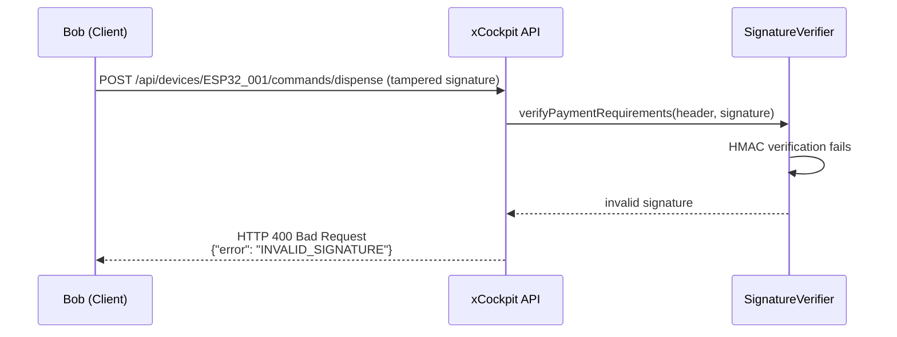
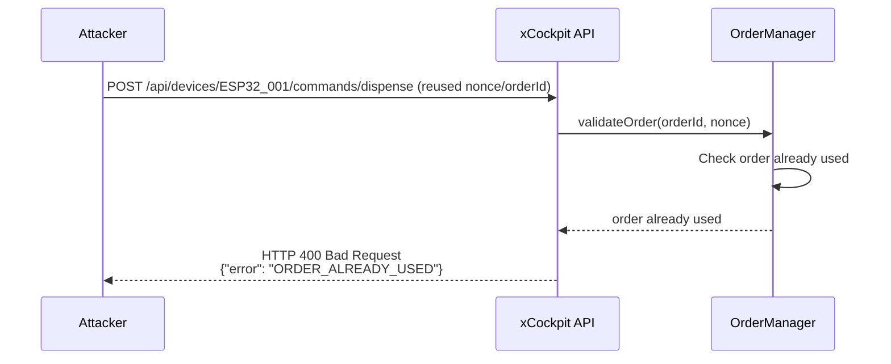
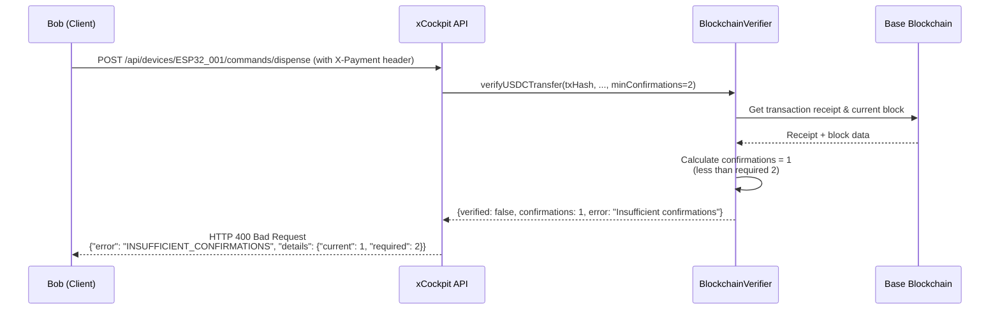
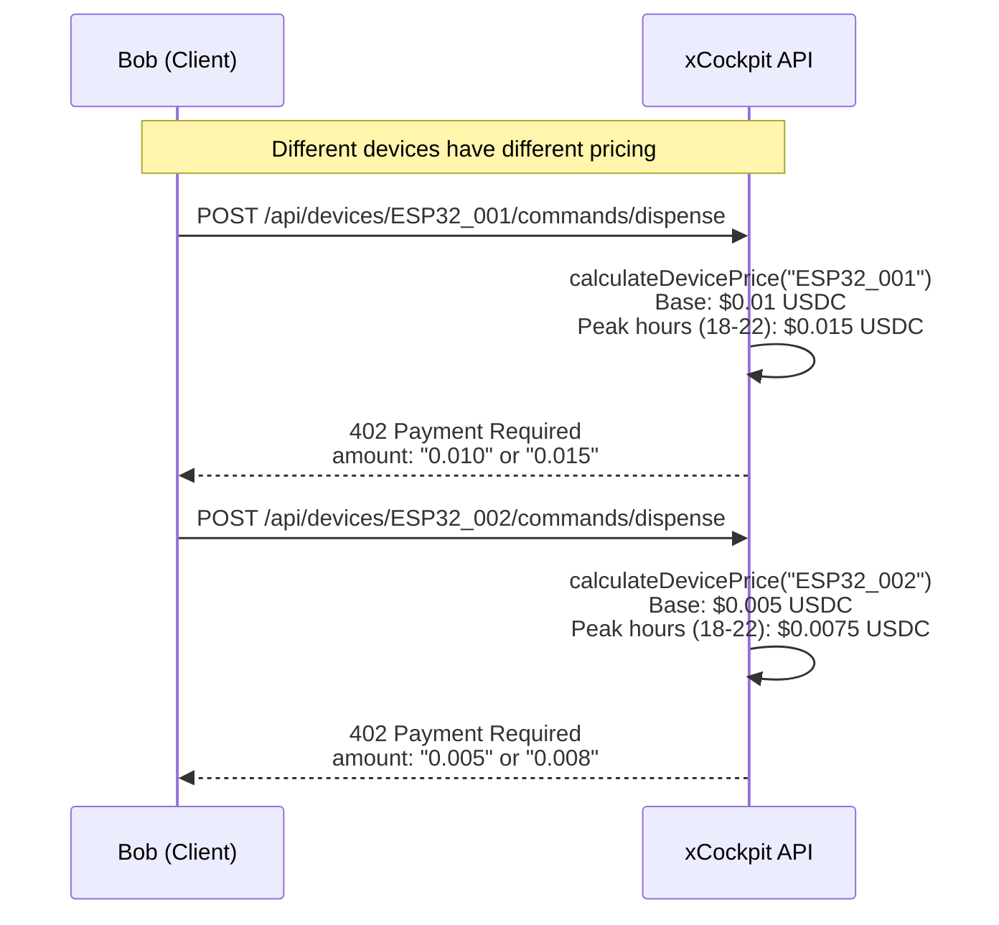
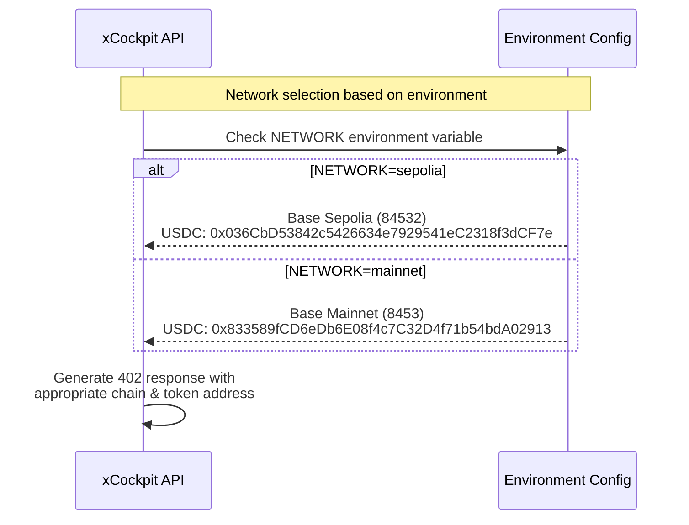
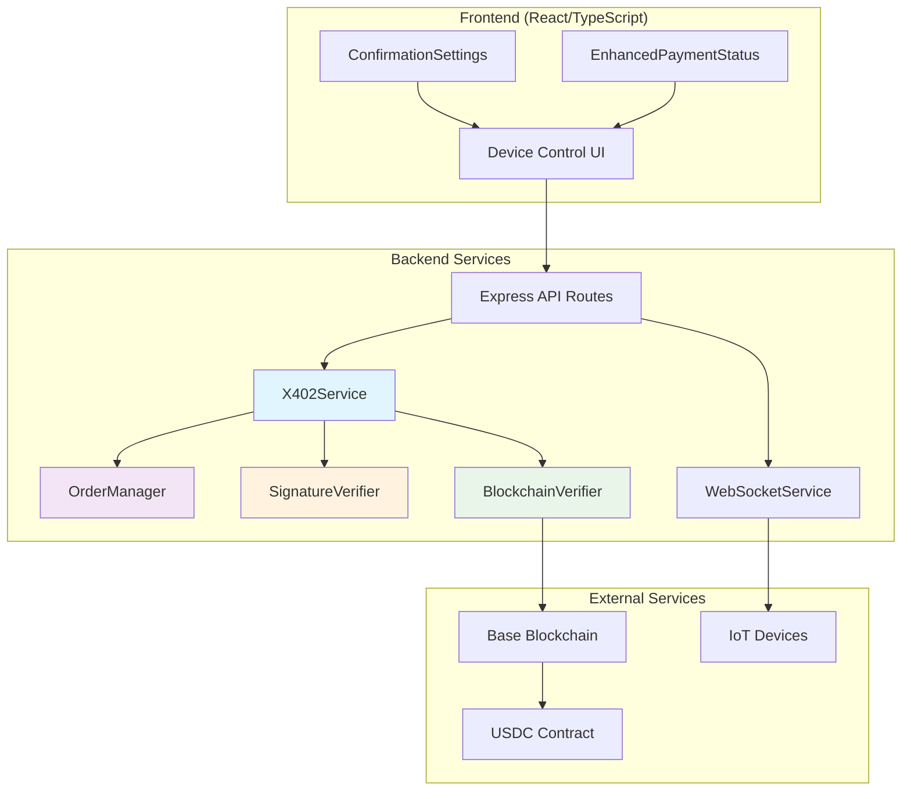

# x402 Enhanced Payment Protocol - Sequence Diagram

現在動作しているx402強化版支払いプロトコルのシーケンス図

## Overview

このシーケンス図は、**x402標準仕様に準拠した**支払いフローを示しています。BobがArisのIoTデバイスを制御するために、同じリソースに`X-Payment`ヘッダを付けて再送する標準的な方式を実装しています。

### x402標準モデル
1. **初回リクエスト**: `/api/devices/{id}/commands/{command}` → `402 Payment Required`
2. **再送リクエスト**: 同じエンドポイントに `X-Payment` ヘッダを付けて再送
3. **成功レスポンス**: `200 OK` with `X-Payment-State` ヘッダー

## Main Payment Flow

```mermaid
sequenceDiagram
    participant Bob as Bob (Client)
    participant API as xCockpit API
    participant OM as OrderManager
    participant SV as SignatureVerifier
    participant BV as BlockchainVerifier
    participant BC as Base Blockchain
    participant Aris as Aris (IoT Device)
    participant WS as WebSocket Service

    Note over Bob, WS: x402 Enhanced Payment Protocol Flow

    %% 1. Device Control Request
    Bob->>API: POST /api/devices/ESP32_001/commands/dispense
    Note right of Bob: User wants to control IoT device

    %% 2. Payment Required Response Generation
    API->>OM: generateOrder(ttlMinutes=5)
    OM->>OM: Generate order_id & nonce
    OM-->>API: {orderId, nonce, nonceExp}
    
    API->>SV: signPaymentRequirements(requirements)
    SV->>SV: Create HMAC-SHA256 signature
    SV-->>API: {requirementsHeader, signature}

    API->>API: Calculate device price ($0.01 for ESP32_001)
    
    API-->>Bob: HTTP 402 Payment Required
    Note right of API: Headers:<br/>X-Payment-Requirements<br/>X-Payment-Signature<br/>WWW-Authenticate: Payment
    Note right of API: Body:<br/>orderId, nonce, expiresAt<br/>payment.accepts[]

    %% 3. Client Payment Execution
    Bob->>Bob: Parse payment requirements
    Bob->>Bob: Display payment UI<br/>Amount: $0.01 USDC<br/>Network: Base Sepolia (84532)
    
    Bob->>BC: Transfer 0.01 USDC to recipient
    Note right of Bob: MetaMask transaction<br/>to: 0x1c7d4b196cb0c7b01d743fbc6116a902379c7238
    BC-->>Bob: Transaction Hash
    
    %% 4. Payment Proof Re-submission (x402 Standard)
    Bob->>API: POST /api/devices/ESP32_001/commands/dispense (RETRY)
    Note right of Bob: Headers:<br/>X-Payment: base64(payment_data)<br/>X-Payment-Requirements: original_header<br/>X-Payment-Signature: original_signature<br/><br/>Payment data:<br/>amount, currency, network<br/>recipient, metadata{orderId, nonce, txHash}

    %% 5. Enhanced Payment Verification
    alt Enhanced Mode (ENHANCED_X402=true)
        Note over API, OM: Enhanced x402 Verification Process
        
        API->>SV: verifyPaymentRequirements(requirementsHeader, signature)
        SV->>SV: HMAC-SHA256 signature verification
        SV-->>API: signature validation result
        
        API->>OM: validateOrder(orderId, nonce)
        OM->>OM: Check order exists, not used, not expired
        OM-->>API: order validation result
        
        API->>BV: verifyUSDCTransfer(txHash, recipient, amount, minConfirmations)
        BV->>BC: getTransactionReceipt(txHash)
        BC-->>BV: Transaction receipt
        BV->>BC: getBlockNumber()
        BC-->>BV: Current block number
        BV->>BV: Parse USDC Transfer events<br/>Verify recipient & amount<br/>Calculate confirmations
        BV-->>API: {verified: true, confirmations: 3, actualAmount: "0.01"}
        
        API->>OM: consumeOrder(orderId, nonce, txHash)
        OM->>OM: Mark order as used<br/>Store txHash mapping<br/>Prevent replay attacks
        OM-->>API: order successfully consumed
        
    else Basic Mode (ENHANCED_X402=false)
        API->>API: Basic field validation
        Note right of API: Check txHash, amount, recipient present
    end

    %% 6. Device Command Execution
    API->>WS: sendCommandToDevice(ESP32_001, "dispense")
    WS->>Aris: WebSocket command
    Note right of WS: {"command": "dispense", "deviceId": "ESP32_001"}
    Aris->>Aris: Execute dispensing action
    Aris-->>WS: Command executed successfully
    WS-->>API: Device response

    %% 7. Success Response (x402 Standard)
    API-->>Bob: HTTP 200 OK
    Note right of API: Headers:<br/>X-Payment-State: paid; chain="eip155:8453"; tx_hash="0x..."; confirmations="3"<br/><br/>Body:<br/>result: "dispense"<br/>deviceId: "ESP32_001"<br/>paymentId, txHash, confirmations<br/>amount: "0.01", currency: "USDC"<br/>expiresIn: 30

    %% 8. Real-time Updates (Optional)
    WS->>Bob: WebSocket notification
    Note right of WS: Real-time device status update
```

## Error Handling Flows

### Invalid Signature Flow


### Replay Attack Prevention


### Insufficient Confirmations Flow


## Device-Specific Pricing Flow



## Network Configuration Flow



## Component Architecture



## Key Features Implemented

### Security Features
- **HMAC Signature Verification**: Prevents tampering of payment requirements
- **Nonce Management**: Prevents replay attacks with one-time use tokens
- **Order Expiration**: 5-minute TTL to prevent stale order abuse
- **On-chain Verification**: Real blockchain transaction validation

### Payment Features
- **Multi-Confirmation Support**: 0, 2, or 3 block confirmations
- **Dynamic Pricing**: Device-specific and time-based pricing
- **Multiple Networks**: Base Sepolia (test) and Base Mainnet (production)
- **Real-time Status**: WebSocket updates for device operations

### Error Handling
- **Graceful Degradation**: Falls back to basic mode if enhanced features fail
- **Comprehensive Error Types**: Specific error codes for different failure modes
- **Timeout Management**: Configurable timeouts for blockchain operations
- **Retry Logic**: Automatic retry for network-related failures

## Environment Configuration

| Variable | Sepolia (Test) | Mainnet (Production) |
|----------|---------------|-------------------|
| `NETWORK` | `sepolia` | `mainnet` |
| `ENHANCED_X402` | `true` | `true` |
| Chain ID | `84532` | `8453` |
| USDC Address | `0x036CbD...CF7e` | `0x833589...2913` |
| RPC URL | `https://sepolia.base.org` | `https://mainnet.base.org` |

## Pricing Configuration

| Device | Base Fee | Peak Hours Fee (18:00-22:00) |
|--------|----------|---------------------------|
| ESP32_001 (Gacha #001) | $0.01 USDC | $0.015 USDC |
| ESP32_002 (Gacha #002) | $0.005 USDC | $0.0075 USDC |

この実装により、セキュアで拡張性の高いWeb3 IoTデバイス制御システムが実現されています。